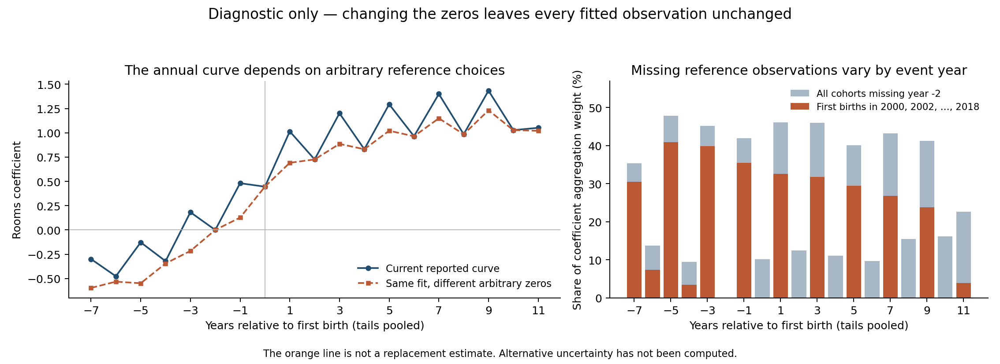

# First-birth rooms: review of the May figure and later corrections

Review requested by Tommaso on September 11, 2026. This is a data-only audit.
It does not change an estimator, empirical target, calibration weight, slide,
or model result. The current annual curve has a demonstrated reference-support
problem and is not certified for substantive presentation by reproduction of
the scalar 0.720246 contrast.

## What is established about May

The May deck embeds the preserved March 13, 2025 figure
`/Users/tommasodesanto/Desktop/Projects/Fertility/Outputs/Graphs/rooms_f_c_y_all.png`.
Its matching 18-row aggregate table is
`/Users/tommasodesanto/Desktop/Projects/Fertility/Outputs/Tables/rooms_f_c_y_all_estimates.dta`.
The table precedes the PNG by four seconds and its coefficients reproduce the
visible curve. Its SHA-256 is
`dd2bb73403b0ebe41c8669b8b5337d5a008338f94940ceb46777d713f24c525d`;
the PNG hash is `337c27ad69cc2452d4cebb4e2d24004c66a3f35a9289eb37417fc3a1a30731e8`.
The aggregate table is exported here as `may_plot_estimates.csv`.

| Event year | May plotted coefficient | Current reported coefficient |
|---:|---:|---:|
| -2 | 0 | 0 |
| -1 | 0.056121 | 0.481499 |
| 0 | 0.165037 | 0.445728 |
| +1 | 0.568573 | 1.014805 |
| +2 | 0.579819 | 0.726160 |
| +3 | 0.796859 | 1.201745 |

The May slide says about 0.66 rooms and its calibration table says 0.664,
although its graph is 0.796859 at +3. The graph's -1-to-+3 difference is
0.740737, also not 0.664. This is a verified reporting inconsistency.
The May +3 standard error is 0.156461 and pre-birth mean is 6.013104 rooms.
Neither table supplies the cross-event covariance needed for the May
-1-to-+3 contrast's standard error.

The exact original executable revision and regression log have not been
recovered. Closely related source files exist under the sibling `Codes/`
directory, but current output paths/specifications differ from the preserved
March 13 artifact. Do not call those files an exact replication.

May explicitly describes person/household and year fixed effects and separately
labels a no-individual-FE appendix. The latter links to a distinct March 15
artifact with +3=0.352687. The later 0.664435 no-ID-FE calibration drift is
documented in `CALIBRATION_STATUS.md`'s August 9 history; it is not proof that
May's root graph omitted individual fixed effects.

## Audit of the claimed corrections

| Change | Verified behavior and assessment |
|---|---|
| Restore individual fixed effects | Corrects documented later reconstruction drift. Missing individual FE has not been established as an error in May's plotted regression. Current builder uses person and survey-year FE. |
| Correct rooms timing | **Directly supported in the checked raw data.** All 525 usable person-wave comparisons across 1984, 1985, 2017 and 2019 match raw rooms to the shelf row one interview earlier. Current code moves that value forward to its actual interview year. This repairs a real extraction offset in the checked data; the exact May executable remains unrecovered. |
| Remove special room codes | Vintage-specific DK/NA codes must not be treated as counts. The historical candidate code and August 9 reconstruction use raw rooms without that cleaning. Their effect on the exact May sample is unmeasured. Zero is a valid coded shared-room response in the authoritative PSID codebooks; treating all zero values as missing would be another substantive decision. |
| Add the -6 indicator | Historical candidate code and the August 9 reconstruction omit both -2 and -6 despite presenting -2 as the reference. The May saved curve has no -6 row. Adding -6 repairs that particular discrepancy, but does not solve cohorts that never have a -2 interview. |
| Change comparison group | The August 9 reconstruction uses the last first-birth cohort (2019) without the required restriction to dates before that cohort is treated. The current confirmed-childless group avoids that particular last-cohort problem. Choosing confirmed childless versus an admissible not-yet-treated comparison is also a design choice, with different selection assumptions. Exact May execution remains unverified. |
| Apply PSID weights | Current regression uses `[pw=IW]`. Nearby historical code creates weights but does not pass them to the Sun-Abraham command. Weighting changes the population represented; lack of weighting is not by itself proof that the old conditional descriptive regression was invalid. |
| One woman per household-year; single family-unit dwellings | The current sample contains 49,457 household-year-unique woman observations for 4,112 women. It excludes 7,338 multi-family-unit dwelling-years and selects current female reference persons/spouses. This addresses repeated household outcomes, while also substantially redefining the population. Alternative unit/clustering choices are possible and must be explicit. |
| Full biological-child history | Current first birth is the earliest biological birth across 20 child records, constructed before reporter selection. Unknown histories and known parents without birth timing are not controls. This is a defensible explicit definition; its numerical difference from May's exact executed history is not measured. |
| Change the reported moment | May's plotted +3 coefficient is relative to -2. The current 0.720246 target is +3 minus -1, with a covariance-based SE of 0.085260. Comparing 0.797 and 0.720 as estimates of the same object is incorrect. |

The current source and outputs match their recorded August hashes. That proves
preservation of the recorded implementation, not correctness of every empirical
assumption. No one-change-at-a-time reconstruction of the May-to-current path
has been completed in this review.

## Direct check of the disputed room-timing correction

The August 17 narrative assertion did not initially supply a reproducible
cross-year comparison. This review therefore made a new, bounded match to the
local raw PSID complete-main-study file, using stable person IDs and official
raw room variables. It reads only selected cells from 512 deterministically
spaced person records; it does not scan or load the multi-gigabyte panels.
The custom selected-cell reader agrees with pandas on 144 raw-file cells and
240 shelf cells.

| Raw interview and room variable | Usable person-waves | Raw rooms equal shelf at same labelled year | Raw rooms equal shelf one interview earlier |
|---|---:|---:|---:|
| 1984, V10432 | 120 | 50 | 120 |
| 1985, V11614 | 123 | 68 | 123 |
| 2017, ER66029 | 139 | 55 | 139 |
| 2019, ER72029 | 143 | 55 | 143 |
| Total | 525 | 228 | 525 |

For example, raw 2019 rooms match `ACTUALROOMS_` on the shelf's **2017** row
in all 143 usable checked cases. The same pattern holds across annual waves:
raw 1985 rooms match the shelf's **1984** row. Among the 292 comparisons where
raw rooms change between adjacent interviews, all 292 still match the
preceding shelf row. Agreement is therefore not merely unchanged housing.

This supplies direct evidence for moving the custom series forward one
interview, rather than relying on its variable name or a codebook's question
wording. Destination-year missing-code rules are consistent with this offset:
the destination year is the actual raw interview year. A proposed claim that
recoding must instead follow the shelf source-row year was rejected in lead
review. Zero remains an observed shared-room response, not DK/NA.

The sample requires current membership in the destination year, observed shelf
room fields at both dates, and actual raw room codes in both adjacent waves
(1--8 through 1984 and 1--20 later). It is not the event-study estimation sample
and is not a full-panel validation of every vintage. The shelf file's recorded
modification time is November 6, 2024, predating the March 2025 plot; this
supports continuity of the problematic input, but is not an executable
provenance certificate for May. Exact read offsets, file sizes/timestamps,
sampling rule, selected-evidence digest, and all aggregate counts are saved in
`raw_timing_verification.json` and `raw_timing_match.csv`.

Primary sources for the coding/design statements:

- [PSID 2019 family codebook, ER72029, p. 9](https://psidonline.isr.umich.edu/documents/psid/codebook/FAM2019ER_codebook.pdf): zero is a shared-room response; 98 and 99 are DK/NA, not room counts.
- [PSID 1984 family codebook, V10432](https://psidonline.isr.umich.edu/documents/psid/codebook/FAM1984_codebook.pdf): zero is shared-room, nine is DK/NA. Code meanings vary across vintages.
- [Sun's eventstudyinteract documentation](https://github.com/lsun20/EventStudyInteract/blob/main/eventstudyinteract.sthlp), last-treated-control instructions: remove dates on and after the control cohort's treatment.
- [PSID study design](https://psidonline.isr.umich.edu/CDS/Guide/StudyDesign.aspx): annual interviews through 1997 and biennial thereafter.

## A demonstrated source of the current zigzag

A cohort here means women with a first birth in the same calendar year. The
stated zero is event year -2. But a woman first giving birth in 2000 would need
a 1998 interview to supply that observation. The recent biennial PSID schedule
has 1997, 1999, 2001, and so on instead. The saved estimation support confirms
that first-birth cohorts 2000, 2002, ..., 2018 have no -2 observation.

The regression drops an additional supported coefficient for those cohorts:
their pooled event times at or before -7 are assigned zero. Other cohorts are
normalized at -2. The aggregate therefore combines levels measured relative to
different dates. Recent even-birth cohorts enter the odd post-birth event years
and are absent from the even ones, giving the reference problem a systematic
odd/even pattern. Across all cohorts, weight on groups lacking -2 is 46.07%
at +1, 12.49% at +2, 46.01% at +3, and 11.04% at +4.

Write a fitted housing observation as

\[
\widehat y_{it}=\alpha_i+\lambda_t+x_{it}'\gamma+\delta_{g,k}.
\]

For a cohort with no -2 row, the transformation
\(\delta_{g,k}^{*}=\delta_{g,k}+c_g\) on all its observed event cells and
\(\alpha_i^{*}=\alpha_i-c_g\) leaves every fitted observation unchanged.
The displayed aggregate, however, changes by \(\sum_g w_{g,k}c_g\).

The executable diagnostic uses the previously exported fitted-sample support
and cohort coefficients. It reassigns recent even-birth cohorts' arbitrary
zero to their observed -1 coefficient, offsetting their person effects.
It verifies the null identity on every final-sample cohort/event support cell.
No data, predictions, comparison units, or regression objective change.

| Saved-data diagnostic | Current normalization | Alternative arbitrary normalization |
|---|---:|---:|
| Average odd post-birth peak above adjacent even-year points | 0.420242 | 0.147472 |
| Difference between +3 and -1 | 0.720246 | 0.758780 |

The peak statistic averages \(b_k-(b_{k-1}+b_{k+1})/2\) at
\(k=1,3,5,7,9\). Its large change establishes normalization sensitivity of
the visible zigzag. It is not a decomposition of causal bias, and the remaining
oscillation is not fully diagnosed. The alternative still mixes -1 and -2
references; it is deliberately NOT a corrected estimate or a presentation
replacement. Alternative confidence intervals have not been calculated.



The earlier September 5 check changed one cohort (1986) and moved the scalar
contrast by only 0.010213. That single direction does not bound the effect of
all admissible normalizations, nor certify the annual curve. The present
calculation changes no retained calibration target.

## Required next empirical checks

1. Retain the timing shift for the checked mapping. Extend the raw-variable
   validation across all survey vintages and nonstandard interview histories
   before a production re-estimation; do not undo the shift because the later
   graph looks worse.
2. Recover the original executed May specification if possible. Otherwise label
   a reconstruction as such, preserve the exact plotted table, and do not claim
   that a changed implementation reproduces May.
3. Estimate a design in which every included cohort has an observed reference
   window. A two-year event clock with a pre-birth window spanning -2/-1 is a
   candidate, but changes the estimand and needs explicit support checks and
   re-estimation; smoothing existing annual points would not accomplish this.
4. Change measurement, control construction, sample/unit, and weighting
   sequentially, saving complete paths, counts, comparison-group definitions,
   cohort weights, and joint covariance. The author must choose any replacement
   empirical contract before it affects calibration.

## Reproduction and verification

Run from the repository root with the local Python environment containing
Matplotlib:

```sh
MPLCONFIGDIR=/tmp/psid-event-study-mpl python3 code/data/psid_followup_mar2026/review_first_birth_event_study_corrections.py
python3 code/data/psid_followup_mar2026/review_first_birth_event_study_corrections.py --check-raw-timing
```

The driver writes `cohort_reference_audit.csv`, `event_curve_audit.csv`,
`normalization_diagnostic.png`, and `verification.json` in this directory.
The second command separately reproduces the bounded raw timing match.
To repeat the independent reader check, use the bundled Python environment
containing pandas with the same driver and `--validate-reader`.
It verifies the historical input hashes before and after processing, final
sample counts and unchanged paired-sample membership, and reconstructs all
19 current plotted points within 8.8e-8 rooms (the primary event CSV used float
storage). The algebraic fitted-value change is exactly zero on all saved
final-sample support cells. This is an exact design identity evaluated on
aggregate support, not a fresh microdata regression replay. No long numerical
run was needed. The May table export uses the bundled runtime's
`pandas.read_stata` on the preserved 18-row original artifact.

## Author-recognized reference and controlled timing comparison

In the follow-up discussion Tommaso identified
`/Users/tommasodesanto/Desktop/Projects/Fertility/Codes/code_per tommi_addingcontrolsandfixingthings.do`
as the Ludovica-era file in line with his regressions, although it was not the
production script. He states that this code produced the May graphs through
its modifications. This author-provided provenance is accepted as the working
baseline; absence of an exact historical execution log is not a reason to
dispute it. A byte-for-byte evidence copy is `author_recognized_reference.do`,
SHA-256 `0262dadfb07b5a998bcbe3c32e58593556f4fb62d399ace97cb4e6189474c011`.
Its original whitespace is intentionally preserved.

The original long PSID-SHELF panel does not contain ACTUALROOMS_. The field is
in `mobility_long_withadd.dta`, which `Codes/merger_SHELFmobility.do` merges by
ID/year. A deterministic 512-row input probe recovered 480 matching person/year
rows in the merged panel, including 244 observed rooms values; all 244 were
unchanged at the same labelled year. The code constructing the added file
was not recovered in bounded code, archived-chat, and editor-history searches.

Archived August 17 conversation establishes Codex subagent
`first_birth_rooms_target_repair` (Nietzsche), id
`01a00e26-f802-7953-97c5-ed529744de4f`, as the implementer of the bundled
rooms/sample/control redesign. It announced the offset at 01:26 EDT;
subsequent reviews added the household/history restrictions and proposed the
+3-minus-1 contrast. Evidence: `memory/transcripts/2026-08-17/combined_user_assistant.md`
around line 34960. September 10 task "Update September presentation slides"
introduced the diagnostic curve into the September deck. This identifies
the later assistant changes, not the original 2024 extraction author.

The author authorized a controlled comparison. Preparation driver
`../../audit_original_rooms_timing.py` copies the recognized source's preparation
block through `compress`, selectively loads its required columns, and carries
a second rooms column shifted forward one observed interview. Donor alignment
is computed before sample restrictions and permits one/two-year gaps. Both
columns retain the original special room codes: this isolates timing rather
than bundling coding changes. The original first-birth field, all-sex sample,
last-cohort control, unweighted regression, covariates, individual/year FE,
clustering, and omitted -2/-6 indicators are retained.

Three planned fits in `../../audit_original_rooms_timing.do` are:
1. Original assignment on its original complete sample.
2. Original assignment on observations complete under both assignments.
3. Shifted assignment on that identical common sample.

The preparation passed in 38.1 seconds. It preserves a constant first-birth
year within every person. Complete input counts, before singleton removal:

| Sample | Observations |
|---|---:|
| Original assignment | 361,231 |
| Shifted assignment | 394,167 |
| Common sample | 352,250 |
| Original observations lost to common-sample restriction | 8,981 |

The exact three-fit loop passed on synthetic data, including byte-identical
common-sample person/year keys and finite covariance-based contrast SEs.
Before allocating regression interactions, observations unusable under both
assignments are removed; an assertion verifies that this preserves the full
cohort list. These rows would be excluded by the estimator's marksample/markout
in either arm. This reduces memory allocation without changing fitted rows.

Common-sample support has 16 treated cohorts without K=-2. A -2/-1 window
reduces that to four: 1968, 1969, 1970, and 1977. Binning alone therefore does
not solve all reference support. Any subsequent reference repair must handle
those cohorts explicitly and separately address the last-control treatment
date; no such design has been promoted or estimated in this comparison yet.

The old local reconstruction took approximately 31 minutes for one fit.
Planned Torch execution uses three parallel fits, each 8 CPUs/32 GB with a
45-minute hard cap, following the exact-loop smoke; queue time is additional.
`code/cluster/run_original_rooms_timing.sh` writes a ten-second heartbeat,
per-fit receipts, full event covariance and sample-key digests. Person/year
keys are removed after hashing; only aggregate outputs will be collected.

**Current execution state: local original fit reached its cap without estimates.**
Automatic approval review rejected the proposed Torch transfer; Tommaso then
explicitly directed that this diagnostic run locally. No microdata was uploaded
and no Torch job was launched. The cluster plan above is superseded. The local
runner first tried eight threads with a 600-second cap, then one thread with
a 300-second cap; both stopped without estimates. Failed logs/receipts are
retained in `timing_local/original_native/` and `timing_local/p1/original_native/`.
A CPU sample showed active OpenMP computation/synchronization. A small paired
thread-count check reproduced coefficients to numerical precision but did not
establish a speed advantage for one thread. A proposed algebraic acceleration
was reviewed but was not implemented or used.

After the author's renewed instruction to proceed, the unchanged original
fit ran under `baseline_complete`, with eight threads and a 2,700-second cap.
It stopped after 2,701.63 seconds without estimates; the failed receipt and log
are in `timing_local/baseline_complete/original_native/`. No regression remains
running. The historical comparison's approximately 31-minute runtime did not
predict this fit's completion. Exact-loop validation had passed before launch,
but the real-data reproduction and all timing-only comparisons remain pending.
`../../render_original_rooms_timing.py --run-label baseline_complete --baseline-only`
is prepared to compare a successfully completed baseline with May; it requires
a passing receipt and cannot produce a reproduction from this failed run.
The recommendation for a possible overnight calibration is to retain
0.7202462623815278 rooms and its existing weight provisionally. The author
clarified that he requested only this number, not task creation or a launch;
the assistant's pending overnight-task creation was a mistake and must not
initiate a run. No validated replacement target has been produced by this audit.
Private inputs remain under
`/tmp/psid_original_timing_20260912b/`; no microdata is committed here.
Preflight evidence is in `preparation_receipt.json`, `sample_comparison.json`,
`matched_reference_support.csv`, and `timing_comparison_preflight.json`.
