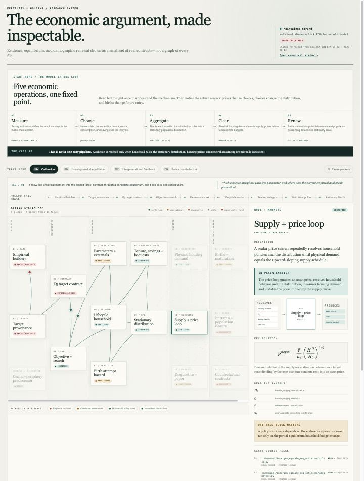

# Fertility × Housing Research Map

An interactive, local map of the project’s economic argument. It shows a curated set of empirical, calibration, household, equilibrium, demographic-renewal, policy, and paper objects—not the repository’s file tree.



## Launch

Requirements: Node.js `>=22.13.0`. From this directory:

```bash
npm ci
npm run refresh
npm run dev
```

Open [http://localhost:3000](http://localhost:3000). The interface is read-only with respect to research source code.

Useful checks:

```bash
npm test
npm run lint
```

## Refresh live project state

`npm run refresh` parses the repository above this tool and rewrites `app/generated-status.json`. It reads the canonical calibration status, the active E5 profile, the target launcher fingerprint, and source-file existence checks. To point a copied tool at another checkout:

```bash
npm run refresh -- --repo /absolute/path/to/Fertility_Spring26
```

Run the refresh whenever `CALIBRATION_STATUS.md`, the active target profile, parameter bounds, weights, or the target fingerprint changes. Economic descriptions, topology, equations, trace membership, and status semantics are deliberately reviewed content in `app/project-data.ts`; they should not change automatically just because a filename appears.

## Visual architecture

The desktop view is a five-zone systems map: evidence → calibration → household decisions → markets → renewal and outputs. It contains sixteen inspectable blocks and nine moving packet types. Four trace modes suppress most links so the user can follow one question at a time:

- **Calibration:** empirical moments → signed target contract → parameters → household equilibrium → SMM comparison.
- **Housing market:** prices → household tenure/space policies → stationary distribution → physical demand → supply and price clearing.
- **Intergenerational feedback:** births → maturation → entrants and stationary scale → aggregate demand and prices → fertility.
- **Policy counterfactual:** labeled wedges → decisions → equilibrium and population closure → fiscal/diagnostic/paper output.

The page starts with a five-step explanation—measure, choose, aggregate, clear, renew—so the map can be read as an economic fixed point before it is explored as a network. Each trace also has a compact, numbered route that works as a guided reading order.

At narrow widths the selected trace becomes a vertical sequence; the complete canvas is intentionally hidden. Clicking any block or packet opens:

- a formal definition and plain-English intuition;
- an input → object → output mechanism sketch;
- a KaTeX-rendered equation, an equation reading, and a symbol glossary;
- its role in the economics and a short debugging checklist;
- exact files with a stable GitHub link pinned to the commit captured at refresh time, plus a copied absolute local path;
- live contract tables where relevant, current status and caveats, and a reproduction command.

The selected object is written to the URL fragment (for example, `#price-clearing`), so a particular block can be bookmarked or shared. “Generate investigation prompt” exposes and copies a scoped AI handoff that includes the explanation, exact sources, debug questions, and mandatory-startup instruction.

Status colors are claims, not decoration: **certified** means an implementation or artifact is verified; **provisional** means active but not fully promoted; **diagnostic** means useful for diagnosis rather than production; **stale** means historical and non-comparable; **empirically held** marks a blocked measurement or provenance contract. These meanings are repeated in the inspector.

## Boundaries and limitations

- The map parses current scalar status and target/parameter contracts, but it does not run the model or claim a current target-fit table. Deliberately, it shows no scalar SMM loss without the complete per-moment fit packet required by `AGENTS.md`.
- File-to-object topology and prose remain curated. A parser cannot safely infer economic meaning, identification, or whether a historical artifact has become authoritative.
- Provenance metadata are incomplete upstream for most E5 rows; the map surfaces the current first-birth-rooms hold but cannot manufacture missing estimator/sample/FE/clustering records.
- The active map follows the retained one-market shared-clock E5b strand. The older center–periphery model appears only as a stale predecessor, and the proposed independent-child maturation architecture is not presented as promoted.
- Moving packets show causal/data contracts, not measured magnitudes or simulation time. They are inspectable labels, not animated quantities.
- This is a local research tool. It has no file editor, model runner, persistent annotations, or automatic source-line anchors. GitHub links point to whole files; output-only paths remain local because generated artifacts are not assumed to be in Git.
- The Vinext prototype uses React plus KaTeX for accessible math and no graph/chart package, but its local build toolchain is still larger than a hand-written static page. The checked-in native development pins target this repository’s current macOS x64 workstation.

## Best next iteration

Add a versioned `research_map_manifest.json` generated by the authoritative empirical and model drivers. Each target row would carry builder, estimator, sample, fixed effects, clustering, uncertainty, last successful run, artifact path, and target-contract fingerprint. The map could then compare the manifest with `CALIBRATION_STATUS.md`, flag drift automatically, and open exact source-line anchors without scraping prose.

The narrow-width QA preview is at [`preview/research-map-mobile.jpg`](preview/research-map-mobile.jpg).
