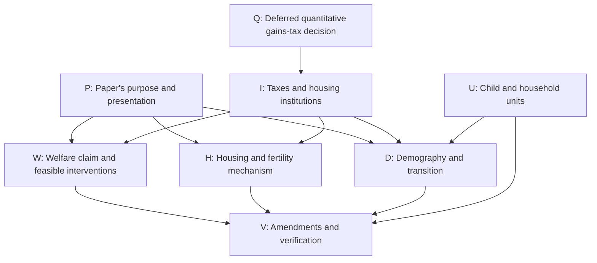

# Active Theory and Quantitative Decision Ledger

Updated: 2026-08-19

This is the short working ledger for the current paper. It records decisions
that can still change the theory, quantitative interpretation, or paper-facing
claims. `CALIBRATION_STATUS.md` remains the source for numerical results and
reproducibility contracts.

## Simplified theory discussion map

Started 2026-09-04 at Tommaso's request to explore the review's decisions one
at a time while retaining every branch. This section is the live record of
that discussion. The numbered register below remains background for earlier
theory and quantitative decisions; it has not yet been reconciled with the
independent review. No substantive author choice is inferred from reading the
review or agreeing to discuss it.

**Resume here:** H0, the intervention whose fertility effect we want to
establish. W0 fixes the allocation-efficiency objective; W1 permits the
planner to relax private borrowing limits. I0 now leaves realized capital-gains
taxation outside the core argument as a deferred extension, to be revisited
when Q0 considers inclusion in the quantitative model. The stronger W1
benchmark retaining borrowing limits is also parked. The working proof route
is a compensated Pareto improvement at fixed fertility, followed by a
separate fertility result. Exact transfers, welfare coverage, and real costs
remain proof obligations under W4/I1/W3. No model or manuscript amendment has
begun.

**Review evidence:**
[`simplified_olg_independent_review.tex`](../../latex/JMP_DS_suggestions/simplified_olg_independent_review.tex),
with its [19-page PDF](../../output/pdf/simplified_olg_independent_review.pdf).
The report is a dated assessment, not a record of accepted author decisions.
Retain it as the starting evidence; record later disagreements and resolutions
here rather than silently rewriting what the review said.

### How to use and maintain this map

- Give each question a stable ID. Record new branches when they arise; do not
  erase alternatives merely because the conversation follows another branch.
- Discussion status is **OPEN**, **ACTIVE**, **TENTATIVE**, **DECIDED**,
  **PARKED**, or **REOPENED**. A tentative preference is not an author decision.
  A parked branch needs a reason and a condition for revisiting it.
- Keep three objects separate: what the evidence supports, what Tommaso
  chooses, and what has actually been amended and verified. A mathematical
  claim is not made true by a vote, and agreement to a claim is not a code check.
- For each developed node retain: exact question; alternatives; assumptions;
  evidence and unresolved objections; lead recommendation; author's choice in
  his own words with date; dependent nodes; and amendment/verification status.
  Initially the table records the question and dependencies; expand its node
  when discussed instead of creating a separate note for every question.
- At a detour, record the suspended question and return point in the traversal
  record. Cross-links matter: choices about taxes, institutions, and population
  change the obligations on several other branches.
- When an upstream choice changes, mark affected downstream decisions
  **REOPENED** or **needs recheck**, with the reason. Preserve the prior choice.
  Never silently carry a result into a different feasible set or target claim.
- After each substantive exchange, save a short delta: settled; still open;
  newly created branches; and next question. Save before ending the turn and
  before drafting amendments. Read this section when resuming the discussion.
- Draft agreed manuscript changes in `latex/JMP_DS_suggestions/`. Close an
  amendment only after checking the relevant prose, equations, code, and claim
  ledger together. The protected manuscript remains author-controlled.

### Branch overview

The arrows indicate dependencies to revisit, not a mandatory reading order.
The map permits multiple retained contributions; it does not force a choice
between mechanism analysis and welfare analysis before either is understood.

| ID | Question and retained alternatives | Status | Dependencies / consequences | Review evidence |
|---|---|---|---|---|
| P0 | The stated priority is an allocation-efficiency result, with fertility effects as an additional result. The complete paper role and placement remain to be decided. | TENTATIVE | Follow the author's objective in W0; do not presume adoption of the review's recommendation to omit main-text welfare. | Sections 1, 6, 8, 10; W0 discussion below |
| W0 | Desired result: equilibrium inefficiency, demonstrated by a planner reallocating housing toward young households without relying on fertility benefits; fertility effects are a subsequent claim. | DECIDED | Research objective only. Feasible set remains W1; compensation, welfare population, and criterion remain W4. Truth and generality are not decided by the objective. | Sections 3-4; W0 discussion below |
| W1 | The planner may relax private borrowing limits for the current benchmark. A theorem retaining those same limits is desirable but parked. | DECIDED | Financing permission only; specify real costs and the title, estate, lender, and dated-transfer conditions. This is not a choice to remove every institutional restriction. | Section 4, A-B; W1 discussion below |
| W2 | The gains-tax/common-rebate construction is deferred with the gains-tax extension. Preserve the zero-cost result, eligibility qualifications, and unresolved implementation questions. | PARKED | Revisit through Q0/I0. A tax-revenue result for unconstrained buyers remains distinct from the core financing result. | Section 4, C; I0 discussion below |
| W3 | State the real cost and its incidence for the core compensated reallocation. The positive-cost/common-rebate gains-tax extension is separately deferred. | OPEN | W1/W4 for core costs; Q0/W2 for the parked tax extension. Average surplus alone does not settle individual compensation under a common rebate. | Section 4, cost extension |
| W4 | Working proof criterion: a compensated Pareto improvement at fixed fertility. Exact welfare coverage and protection of future households must be made explicit. No social-weighted optimum or welfare ranking across different populations has been selected. | TENTATIVE | The lead carries forward the proposed Pareto test as the proof route; preserve all real and dated resource constraints. Detailed coverage remains open. | Sections 4, 6; W1 discussion below |
| I0 | Keep the core allocation result based on borrowing constraints. Realized capital-gains taxation is a deferred extension, to revisit when deciding whether to include it in the quantitative model. | DECIDED | W2 and gains-tax-specific transition work are parked. Property taxation is a separate instrument. Source and code amendments remain pending. | Sections 5-6, 8; I0 discussion below |
| Q0 | Should realized capital-gains taxation enter the quantitative model, with the necessary institutional, empirical, and state-variable justification? | PARKED | Author's explicit return condition for the gains-tax extension. If this decision becomes active, revisit I0/W2 and relevant D1-D2 obligations. No quantitative implementation or run is authorized by this deferral. | I0 author statement below; live quantitative contract remains in CALIBRATION_STATUS.md |
| I1 | Which baseline institutions are intended? External bond trade, closing chronology, common rebates, renter size limits, owner title/occupancy restrictions, and estate treatment. Clarify existing restrictions or explicitly choose changes. | OPEN | W1-W3, H0-H1, D0. Keep inheritance of entrant wealth distinct from warm-glow estate utility. | Sections 2, 6-7 |
| H0 | Which intervention should the fertility result describe? Start by specifying the response to the same compensated housing reallocation as the efficiency result; distinguish a pure borrowing-limit relaxation and a funded equilibrium policy. | ACTIVE | W1/W4/I1. The lead recommends matching the welfare and fertility interventions; that linkage and the exact compensation rule remain to be settled. Keep rental-cap alternatives on record. | Sections 3, 6, 8; H0 entry below |
| H1 | Which household ingredients are essential for that mechanism? Continuous positive completed fertility, goods/space requirements, log utility, tenure tastes, and the maintained old-age branches versus richer alternatives. | OPEN | P0, H0, I1. Do not reinterpret the toy model as sequential birth timing or use its elasticities as structural quantitative estimates. | Sections 2-3, 6, 8 |
| D0 | What is the demographic proposition? Cohort accounting, impact response, momentum, housing feedback, replacement, and conditions for absence of a positive closed endpoint. | OPEN | U0, H1, I1. Separate a toy existence example from the live quantitative endpoint problem. | Sections 5-6, 8 |
| D1 | What transition result is needed? Clearly labeled finite-horizon illustration; a fixed-horizon conditional local theorem; an exact infinite-horizon existence result; or existence plus local uniqueness. | OPEN | Gains-tax-specific nonsmooth work is parked with Q0. Other regularity and transition-existence obligations remain; removing the tax kink does not prove the transition theorem. | Section 5; I0 decision |
| D2 | What construction must support the chosen result? Shock direction, fixed housing stock, admissible active sets, terminal closure, numerical scope, and generality across household types. | OPEN | D0-D1, H1. Gains-tax-specific basis/gains diagnostics are deferred with Q0; ordinary boundary and horizon checks remain. The saved taxed example has not been replaced or revalidated. | Sections 3, 5-6 |
| U0 | How do toy fertility, literal children, and entrant households map into one another? Reconcile the conversion coefficient and replacement condition explicitly. | OPEN | Required before interpreting D0-D2 or linking to quantitative units. Existing quantitative units are not reopened by default. | Section 3, details behind audit |
| P1 | Which results and figures go in main text, appendix, or outside the paper? Also decide environment/problem ordering, notation, and exposition. | OPEN | P0 plus selected W/H/D results. The review's proposed five-page allocation is a recommendation. | Sections 7-8 |
| V0 | Which exact amendments and checks implement the agreed choices? Reconcile the existing section, appendix, builder, and claim ledger in one pass; keep manuscript suggestions outside the protected draft. | OPEN | Relevant decisions above. No implementation authorized merely by exploring an option. | Section 9 |

### Corrections and verification work retained across branches

These rows retain every action in the review's 14-row priority ladder, in its
original order. Implementation has **not started** in this discussion; author
choices are recorded separately in the node statuses. Rows described as
corrections can be checked independently; they do not require choosing facts.
Their eventual inclusion and implementation must match the selected claims.

| Review priority row | Action to retain | Governing nodes |
|---|---|---|
| 1 | Separate baseline feasibility from the value of added closing credit. | W0-W1 |
| 2 | Repair the positive-cost/common-rebate sufficiency claim or omit that extension. | W2-W3 |
| 3 | Bound numerical transition and quantitative endpoint claims by the evidence actually available. | D0-D1 |
| 4 | Role decided: deferred extension, tied to the quantitative inclusion decision. Reflect this in the core source when amendments begin. | I0, Q0, P0 |
| 5 | Distinguish young-only from common-cap derivatives and include the old-rent resource effect. | H0 |
| 6 | Reconcile toy child units, replacement, and the literal-child mapping. | U0 |
| 7 | Consolidate equilibrium; state external finance, timing, and title/occupancy restrictions. | I1, P1 |
| 8 | Separate finite-shock Jacobian diagnostics from zero-shock theorem hypotheses. | D1-D2 |
| 9 | Include acquisition basis in terminal checks and threshold reported positive gains dates. | D2 |
| 10 | Put the useful fertility comparative static near the mechanism; shorten the branch catalogue. | H0, P1 |
| 11 | Choose transition-figure size/location and whether to retain the wedge figure. | P1 |
| 12 | Test additional corners only if broader solver coverage is required; retain current-example checks. | H1, D2, V0 |
| 13 | Consider existing-household consumption-equivalent policy welfare under specified fiscal/credit rules. | W1, W4 |
| 14 | Decide whether an exact infinite-horizon result warrants the required work. | D1, P0 |

The full 30-row formal audit remains the evidence inventory in review Section 3.
This map groups its decisions and work obligations rather than treating every
valid algebraic identity as a fresh author choice. Revisit its affected rows
whenever a primitive, branch, or theorem scope changes.

### Source discrepancies to resolve explicitly

- **W2-W3:** the pre-discussion working-tree welfare entry states sufficiency of
  $\ell_t>\bar K_t$ with a common rebate. The independent review contests
  that extension without an incidence/financing condition and supplies a
  counterexample. Retain the zero-cost result and positive-cost extension as
  separate claims while discussing them; do not cite the earlier sentence as
  settled evidence.
- **U0:** the earlier child-unit entry calls the mapping resolved. The review
  notes that the toy example's $\nu=2$ implies replacement $n=0.5$; the
  additional mapping of one toy child unit to 2.1 literal children would then
  imply 1.05 literal children per toy household. The interpretation of that
  combination remains open. This does not change the live quantitative
  divisor on its own.
- **D1:** the earlier transition register uses language about a transition
  between steady states. Keep the computed terminally closed approximation
  distinct from a proved exact infinite path and from the quantitative model.
- **Quantitative boundary:** earlier numbered points contain historical fit
  values and a supply-elasticity recommendation superseded by the September 4
  `CALIBRATION_STATUS.md`. Use that status file for the live contract. No
  calibration choice is made through this theory discussion map.

### W0 discussion: author objective and next fork

**Author statement, 2026-09-04:**

> The claim I would like to be true is that the eq. is inefficient, in the sense that a central planner would reallocate hosuing to young people. this is without considering fertility outcomes preferences, just int erms of marginal utyiliy of housing. on top of hat it would be good to claim fertility effects.

**Recorded choice:** pursue an allocation-efficiency result first and assess
fertility effects separately. Do not treat the desired claim as already true,
as an instruction to manufacture it, or as agreement to arbitrary welfare
weights or a particular financing instrument.

**Working interpretation, to retain explicitly:** hold fertility and cohort
masses fixed in the first allocation comparison. Existing children's space
and goods requirements can remain in preferences. This is not a decision to
set the child-space requirement or the fertility-preference parameter to zero.
Which households must be protected, and whether the statement is Pareto or
uses specified social weights, remain questions under W4.

**Economic distinction for discussion:** raw marginal utilities across people
do not provide a utility-normalization-invariant efficiency test. Use the
marginal rate of substitution $m_i=U_{h,i}/U_{c,i}$, meaning the household's
marginal housing valuation in units of consumption goods. At the maintained
steady-state branches, the existing appendix gives
$m_Y-m_O=\zeta^{O,F}>0$ for a young owner with a positive financing wedge and
an interior old incumbent. This establishes a valuation gap for that pair,
not a universal age ranking or a feasible welfare improvement by itself.
Source: `latex/simplified_olg_paper_theory_appendix.tex`, equations
`eq:olg_app_young_mv` and `eq:olg_app_old_mv`.

A local zero-cost exchange illustrates the required proof: for
$m_O<a<m_Y$, transfer $\epsilon$ units of housing services from old to young,
reduce the young household's goods by $a\epsilon$, and increase the old
household's goods by the same amount. Holding fertility and continuation
allocations fixed, the first-order utility changes are
$U_c^Y(m_Y-a)\epsilon>0$ and $U_c^O(a-m_O)\epsilon>0$.
This illustrates resource-feasible gains when that service-and-goods exchange
is permitted; it does not by itself verify the model's durable-title, estate,
lending, and fiscal implementation. Those remain W1/I1 obligations.

**Lead recommendation at the W0 exchange:** explore a Pareto improvement
relative to a planner who can reallocate real resources and overcome private
financing limits. This is a legitimate resource-feasible benchmark, though
it does not establish constrained inefficiency under the original closing
rules. A planner facing a microfounded enforcement or information restriction
must respect that restriction if it is part of the maintained feasible set.
Do not infer that every weighted planner optimum necessarily raises aggregate
young housing from the existence of one local improving transfer.

The basic welfare distinction between Pareto improvements and changes in the
distribution along a Pareto frontier is also explained in
[Robert Townsend's MIT welfare-theorems lecture](https://ocw.mit.edu/courses/14-04-intermediate-microeconomic-theory-fall-2020/1gcajw7hbthjPcO8f8wCXWoKIBXEYkUEH_transcript.pdf).
This is background for the criterion, not evidence for the project-specific
reallocation theorem.

**Question raised at this exchange:** may the planner overcome the private
financing constraint, or must the desired inefficiency result survive that
same constraint? The subsequent W1 entry records the author's answer.
**Return point:** once W1 and the relevant W4 conditions are settled, identify
the smallest valid allocation proposition. Then return to H0 for the fertility
response; an allocation improvement does not by itself sign that response.

### W1 discussion: financing permission adopted

**Author statement, 2026-09-04:**

> I think it's fine to think that the palnner can relax the oborrowing limits. the stronger requirement would be nice, but i think for now we can do.

**Decision:** the current planner benchmark may overcome private borrowing
limits. This answers the financing fork only; it does not waive real resource
costs, outside lenders' claims, or the need for a complete feasible allocation.
The allocation-efficiency objective and the separate fertility extension remain.

**Parked alternative:** prove constrained inefficiency with the original
borrowing rules retained. It remains desirable, not rejected. Revisit if the
paper requires an intervention feasible under those rules, or after the core
allocation result and its policy interpretation are settled. The gains-tax
result under W2 remains a distinct possible route within that alternative.

**Proof route carried forward by the lead:** use the compensated Pareto
comparison proposed in W0. The old household must be compensated for the lost
space and any relevant estate consequences; the young household's gain must
remain positive after repayment, compensation, and real costs; outside
lenders and unaffected households cannot finance the gain through losses.
Fertility remains fixed for this comparison. The precise transfer dates and
welfare coverage must be specified in the eventual proof. No arbitrary social
weights or additional benefit from births are needed for this proof route.

Under the existing appendix's maintained interiority and transfer assumptions,
the steady-state valuation gap is $m_Y-m_O=\zeta^{O,F}$. If $K$ denotes the
marginal real cost of reallocating housing, the local sufficient inequality is
$\zeta^{O,F}>K$. This identifies why a financing-based result can be developed
without realized capital-gains taxes; it is conditional on the complete
implementation assumptions, not established merely by the author's choice.
No cost value, tax removal, or general first-best planner optimum has been
adopted here.

**Question raised for I0:** should the core allocation result be established using the
financing friction, with realized capital-gains taxation considered separately?
The lead recommends that separation to isolate the mechanism and obtain a
steady-state result. The subsequent I0 entry records the author's decision.
Property taxation is a different instrument; this question does not imply
removing it.

### I0 discussion: capital-gains extension deferred

**Author statement, 2026-09-04:**

> i agree with your recommendation. we should leave it as extension and defer that to when we decide whether to put it in the quant model or not

**Decision:** the core allocation result uses the borrowing friction. Realized
capital-gains taxation remains an extension, deferred until the author
considers whether to include it in the quantitative model (Q0). This is not
permanent rejection and not a decision to add the tax to the quantitative
model. The quantitative contract and the property-tax instrument are unchanged.

**Dependency update:** park W2, the gains-tax-specific part of W3, and the
gains-kink/basis/gains-date work within D1-D2. Preserve their objections and
conditions for the return to Q0. General transaction costs, compensation,
demographic propagation, and transition verification remain relevant. The
existing sources still contain gains taxation; their later reconciliation
must implement this author decision without deleting the retained extension.

### H0 discussion entry: connect the fertility effect to an intervention

The next open question is which intervention the fertility claim follows.
The lead recommends evaluating the same compensated reallocation used in the
efficiency comparison, with its financing and compensation rule stated. A
pure borrowing-limit change and a funded equilibrium policy remain distinct
alternatives, as do a young-only cap change and a common rental-cap change.

The existing derivative in `latex/simplified_olg_paper_theory_appendix.tex`,
`eq:olg_fertility_derivative`, holds effective resources, user cost, tenure,
and the old-age branch fixed while raising the current housing limit. It
balances a positive space effect against the goods cost of additional housing.
It does not by itself describe a compensated planner transfer, whose payment
rule can also change effective resources. Nor does a Pareto improvement at
fixed fertility establish a positive fertility response. Derive the response
for the chosen intervention; do not copy the cap derivative or its sign into
the welfare theorem without reconciling those objects.

**Next question:** should the fertility result concern the same compensated
old-to-young housing reallocation, with a separate borrowing-policy response
only if needed? The lead recommends this link; no author choice has yet been
made on the precise fertility experiment or payment rule.

### Traversal and decision record

| Date | Record | Consequence |
|---|---|---|
| 2026-09-04 | Tommaso requested sequential discussion with all branches retained. | Maintain this map and update it after substantive exchanges. |
| 2026-09-04 | Lead proposed W0 as the first question, linked to P0. | Clarify the intended claim before deciding the planner's instruments. |
| 2026-09-04 | Tommaso specified equilibrium inefficiency through a planner's old-to-young housing reallocation as the desired first result; fertility effects are additional. | W0 objective recorded; W1 becomes active. P0 is provisionally welfare-first. No theorem, welfare weights, or planner powers accepted yet. |
| 2026-09-04 | Tommaso accepted relaxing borrowing limits in the planner benchmark; retaining those limits would be desirable but is not required now. | W1 financing permission decided; stronger alternative parked. Carry forward the compensated proof route under W4 and turn to I0's tax-mechanism choice. |
| 2026-09-04 | Tommaso accepted leaving capital-gains taxation as an extension and deferring it until the quantitative-model inclusion decision. | I0 decided; Q0 and W2 parked, along with tax-specific proof/diagnostic work. H0 becomes the current discussion question. |

**Suspended questions / return points:** the W1 alternative retaining private
borrowing limits remains parked. The gains-tax extension and its dependent
work resume when Q0 becomes active. H0 is now being discussed; its derivation
must return to W4/I1 to settle exact compensation and resources. Other branches
remain open.

**Author decisions in this review discussion:** W0 research objective and W1
permission to relax private borrowing limits; I0 defers capital-gains taxation
to an extension linked to Q0. Exact transfers, real costs, and welfare coverage
remain unresolved. Validity and implementation remain proof obligations.

**Lead recommendations, not adopted:** the review's earlier recommendation to
put welfare outside the main text is preserved as history. The current
discussion follows Tommaso's welfare-first objective using his accepted
permission to relax borrowing limits. A compensated Pareto proof is the
working route, and I0 now adopts separation of the gains-tax extension. The
lead recommends linking the fertility claim to the same compensated
reallocation; its exact experiment, paper placement, and general transition
scope remain open.

**Amendments:** none started. The PDF remains the review snapshot; the live
discussion state is here.

## Active points

1. **Child unit resolved.** The live sequential model's parity states count
   literal children and match CPS children-ever-born per woman. The transition
   therefore converts top-code-adjusted child births into future entrant
   households by dividing by `2.1`. In the toy economy, one household-child unit
   corresponds to `2.1` quantitative-model children. The divisor is an external
   replacement normalization, not an explicit childhood-survival state.

2. **Finish the small transition theory.** Write the explicit population law,
   the impact response to lower desired fertility, demographic momentum, the
   housing-price feedback, and the condition under which no positive closed
   steady state exists. The diagrams must follow that law rather than remain
   schematic.

3. **Validate current fertility flows.** Construct the exact model counterpart
   to period TFR and assess whether the model makes post-2023 fertility too low.
   Completed fertility for an older cohort cannot by itself identify the speed
   of the future population transition.

4. **Address the two binding housing-quantity misses.** The first-birth housing
   response and mean rooms remain the largest contributions to the current
   calibration loss. A fresh 23-task radius-`0.01` coordinate panel found no
   material local improvement: the best one-coordinate loss is `36.0222`
   versus `36.0992`, and the eleven-column Jacobian has rank ten at the
   predeclared `1e-3` threshold. Its weakest direction is primarily the already
   low bequest shift. Do not force a ridge update through this weak direction.
   The next structural test should separate the first-child room increment from
   the level of large-home demand or from the tenure utility margin; any added
   parameter requires an identifying moment and a fresh target/code contract.

5. **Quantitative presentation.** The current 2023-forward baseline
   uses household totals and age shares as imposed dated inputs through 2023.
   The fixed four-group alternative is rejected as a demographic closure: it
   resets all age-cell masses, removes most raw youngest entrants, and identifies
   household-formation/headship wedges rather than immigration. The additive
   semi-open prototype preserves endogenous entrants but reveals that an
   explicit household-formation margin is needed. The main exercise is the
   fitted-2023 closed finite-horizon path; the open path is a sensitivity.

6. **Choose and state the long-run interpretation.** Neither the fitted-2023
   baseline nor the four-group historical calibration has a verified positive
   closed terminal steady state: their audited maximum renewal ratios are
   respectively 0.7085 and 0.7094. The closed national paths are finite-horizon
   contraction benchmarks. The open paths are sensitivities to an externally
   normalized entrant flow. Do not describe either as something stronger.

7. **Update the paper and slides after Points 1--3.** Present the old steady
   state, impact response, demographic momentum, and endogenous housing
   feedback in that order. Do not claim movement between two positive steady
   states unless a positive closed root is actually established.

8. **Keep structural policy analysis separate.** The rebated property-tax
   transition may be shown from 2023 through 2035. Lead with the maintained
   national supply elasticity `1.75`; the Coven California elasticity `0.232`
   and the Baum-Snow--Han U.S. urban elasticity `0.5` are impact sensitivities.
   The path is a finite transition with equal rebates, not a stationary or
   welfare comparison.

## Legacy points -- to be reviewed

These were previously recorded as unresolved. They are not automatically part
of the current specification; each must be either revalidated against the live
model or retired explicitly.

1. **Outside-entry anchor.** Decide whether the outside-origin object is an
   age-aggregated net-migration equivalent or a literal age-18 entrant flow.
   The old `0.169` value is presently only an old-state normalization, not a
   constant realized migration share.

2. **Open-closure counterfactual contract.** Reassess the older assumptions of
   policy-invariant outside inflow and policy-invariant local-born retention
   before using an open closure for policy.

3. **Balanced-growth closure.** The older proposal to use a balanced-growth
   path was left unresolved because level housing supply, proportional supply,
   and Stone--Geary housing floors do not fit together innocuously. Review only
   if the current contraction interpretation is rejected.

4. **Housing-supply normalization.** Reconcile the one-intercept representation
   `H^S = H_0 p^xi` with older paper, slide, and packet presentations that use a
   separate reference price. This is a reporting convention, not a reason to
   re-solve the model.

5. **Entry-response primitives.** The older entry taste scale and local-born
   retention weight were not empirically disciplined. They must not return as
   production parameters without targets or explicit external restrictions.

6. **Geographic interpretation.** Separate national demographic renewal from
   local spatial reallocation. A city entrant flow or migration response cannot
   be relabeled as a national population mechanism.

7. **Funded policy and purchase-grant architecture.** The previous funded
   workflow remains disabled. Its renewal accounting must use the live unit
   convention, and purchase-grant eligibility requires a one-time/past-owner
   state to prevent cycling.

8. **Preserved one-shot model.** Keep the circulated one-shot model as a
   documented fallback and comparison, not as the source of current sequential
   transition results.

9. **Older wealth, bequest, and numerical-boundary concerns.** Reopen only if
   they affect the live calibration diagnostics. Historical loss values and
   conclusions from superseded target systems are not comparable to the current
   transition calibration.
