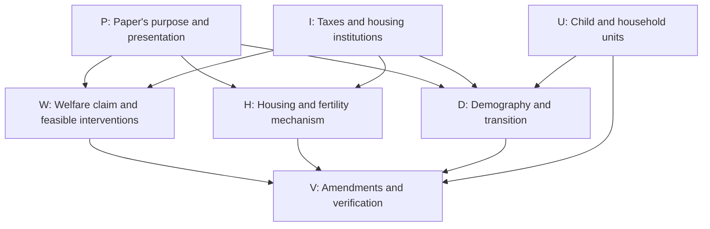

# Active Theory and Quantitative Decision Ledger

Updated: 2026-08-19

This is the short working ledger for the current paper. It records decisions
that can still change the theory, quantitative interpretation, or paper-facing
claims. `CALIBRATION_STATUS.md` remains the source for numerical results and
reproducibility contracts.

## Simplified theory discussion map

Started 2026-09-04 at Tommaso's request to explore the review's decisions one
at a time while retaining every branch. This section is the live record of
that discussion. The numbered register below remains background for earlier
theory and quantitative decisions; it has not yet been reconciled with the
independent review. No substantive author choice is inferred from reading the
review or agreeing to discuss it.

**Resume here:** W0, the intended welfare claim. No substantive decision from
this discussion has been made, and no model or manuscript amendment has begun.
P0 is the related question about the analytical section's role. Start by
understanding the claim Tommaso wants; then examine its feasible set in W1.

**Review evidence:**
[`simplified_olg_independent_review.tex`](../../latex/JMP_DS_suggestions/simplified_olg_independent_review.tex),
with its [19-page PDF](../../output/pdf/simplified_olg_independent_review.pdf).
The report is a dated assessment, not a record of accepted author decisions.
Retain it as the starting evidence; record later disagreements and resolutions
here rather than silently rewriting what the review said.

### How to use and maintain this map

- Give each question a stable ID. Record new branches when they arise; do not
  erase alternatives merely because the conversation follows another branch.
- Discussion status is **OPEN**, **ACTIVE**, **TENTATIVE**, **DECIDED**,
  **PARKED**, or **REOPENED**. A tentative preference is not an author decision.
  A parked branch needs a reason and a condition for revisiting it.
- Keep three objects separate: what the evidence supports, what Tommaso
  chooses, and what has actually been amended and verified. A mathematical
  claim is not made true by a vote, and agreement to a claim is not a code check.
- For each developed node retain: exact question; alternatives; assumptions;
  evidence and unresolved objections; lead recommendation; author's choice in
  his own words with date; dependent nodes; and amendment/verification status.
  Initially the table records the question and dependencies; expand its node
  when discussed instead of creating a separate note for every question.
- At a detour, record the suspended question and return point in the traversal
  record. Cross-links matter: choices about taxes, institutions, and population
  change the obligations on several other branches.
- When an upstream choice changes, mark affected downstream decisions
  **REOPENED** or **needs recheck**, with the reason. Preserve the prior choice.
  Never silently carry a result into a different feasible set or target claim.
- After each substantive exchange, save a short delta: settled; still open;
  newly created branches; and next question. Save before ending the turn and
  before drafting amendments. Read this section when resuming the discussion.
- Draft agreed manuscript changes in `latex/JMP_DS_suggestions/`. Close an
  amendment only after checking the relevant prose, equations, code, and claim
  ledger together. The protected manuscript remains author-controlled.

### Branch overview

The arrows indicate dependencies to revisit, not a mandatory reading order.
The map permits multiple retained contributions; it does not force a choice
between mechanism analysis and welfare analysis before either is understood.

| ID | Question and retained alternatives | Status | Dependencies / consequences | Review evidence |
|---|---|---|---|---|
| P0 | What should the analytical section establish? Housing-access/fertility mechanism; an allocation or policy-welfare contribution; demographic propagation; or a justified combination. | OPEN | Guides placement and required proof effort across all branches. | Sections 1, 6, 8, 10 |
| W0 | What exactly is the desired welfare claim, for whom and relative to what comparison? A private valuation gap; a feasible Pareto improvement; or the effects of a specified policy are distinct claims. | ACTIVE | Clarify before selecting W1 or treating the financing wedge as a welfare result. Links to P0 and W4. | Sections 3-4 |
| W1 | Which instruments and constraints define the comparison? Baseline closing rules; an explicit pledgeable advance; targeted transfers at two dates; or another specified intervention. | OPEN | W0. Determines which parts of A/B apply and which financing costs or institutional justifications must be supplied. | Section 4, A-B |
| W2 | Does the gains-tax/common-rebate construction earn a place? Assess the zero-cost result, recipient eligibility, continuation accounting, and whether a constructed allocation is decentralized by an actual policy. | OPEN | W0, W1, I0. A tax-revenue result for unconstrained buyers is not a result about the displayed constrained buyers. | Section 4, C |
| W3 | If real transaction costs are retained, who pays and how is each participant compensated? Zero costs; explicit public cost financing; or participant-specific conditions. | OPEN | W1-W2. Average surplus alone does not settle individual compensation under a common rebate. | Section 4, cost extension |
| W4 | Whose welfare is evaluated, with what population held fixed? Existing households with fixed fertility; existing-household policy welfare; or an explicit criterion covering different future populations. | OPEN | W0-W2 and U0/D0 if populations differ. Keep the welfare population and the policy's demographic effects distinct. | Sections 4, 6 |
| I0 | Does realized capital-gains taxation belong in the main model, an extension, or neither? Establish its intended economic contribution and connection to the quantitative exercise. | OPEN | P0; changes relevance of W2-W3 and the gains kink in D1. Removing the kink alone does not prove an infinite-horizon transition. | Sections 5-6, 8 |
| I1 | Which baseline institutions are intended? External bond trade, closing chronology, common rebates, renter size limits, owner title/occupancy restrictions, and estate treatment. Clarify existing restrictions or explicitly choose changes. | OPEN | W1-W3, H0-H1, D0. Keep inheritance of entrant wealth distinct from warm-glow estate utility. | Sections 2, 6-7 |
| H0 | Which housing-access experiment should the derivative describe? A current-young cap change, a common cap change at both ages, an LTV/liquid-wealth change, or a funded equilibrium policy. | OPEN | I1. Specify held-fixed prices, transfers, tenure, and old-age commitments before using the derivative. | Sections 3, 6, 8 |
| H1 | Which household ingredients are essential for that mechanism? Continuous positive completed fertility, goods/space requirements, log utility, tenure tastes, and the maintained old-age branches versus richer alternatives. | OPEN | P0, H0, I1. Do not reinterpret the toy model as sequential birth timing or use its elasticities as structural quantitative estimates. | Sections 2-3, 6, 8 |
| D0 | What is the demographic proposition? Cohort accounting, impact response, momentum, housing feedback, replacement, and conditions for absence of a positive closed endpoint. | OPEN | U0, H1, I1. Separate a toy existence example from the live quantitative endpoint problem. | Sections 5-6, 8 |
| D1 | What transition result is needed? Clearly labeled finite-horizon illustration; a fixed-horizon conditional local theorem; an exact infinite-horizon existence result; or existence plus local uniqueness. | OPEN | P0, I0, D0. Each retained claim has its own assumptions and verification burden. | Section 5 |
| D2 | What construction must support the chosen result? Shock direction, fixed housing stock, admissible active sets, terminal closure, numerical scope, and generality across household types. | OPEN | D0-D1, H1. Appreciation is an example, not a signed response to every fertility shock. | Sections 3, 5-6 |
| U0 | How do toy fertility, literal children, and entrant households map into one another? Reconcile the conversion coefficient and replacement condition explicitly. | OPEN | Required before interpreting D0-D2 or linking to quantitative units. Existing quantitative units are not reopened by default. | Section 3, details behind audit |
| P1 | Which results and figures go in main text, appendix, or outside the paper? Also decide environment/problem ordering, notation, and exposition. | OPEN | P0 plus selected W/H/D results. The review's proposed five-page allocation is a recommendation. | Sections 7-8 |
| V0 | Which exact amendments and checks implement the agreed choices? Reconcile the existing section, appendix, builder, and claim ledger in one pass; keep manuscript suggestions outside the protected draft. | OPEN | Relevant decisions above. No implementation authorized merely by exploring an option. | Section 9 |

### Corrections and verification work retained across branches

These rows retain every action in the review's 14-row priority ladder, in its
original order. They are **not started** in this discussion. Rows described as
corrections can be checked independently; they do not require choosing facts.
Their eventual inclusion and implementation must match the selected claims.

| Review priority row | Action to retain | Governing nodes |
|---|---|---|
| 1 | Separate baseline feasibility from the value of added closing credit. | W0-W1 |
| 2 | Repair the positive-cost/common-rebate sufficiency claim or omit that extension. | W2-W3 |
| 3 | Bound numerical transition and quantitative endpoint claims by the evidence actually available. | D0-D1 |
| 4 | Decide the role of capital-gains taxation. | I0, P0 |
| 5 | Distinguish young-only from common-cap derivatives and include the old-rent resource effect. | H0 |
| 6 | Reconcile toy child units, replacement, and the literal-child mapping. | U0 |
| 7 | Consolidate equilibrium; state external finance, timing, and title/occupancy restrictions. | I1, P1 |
| 8 | Separate finite-shock Jacobian diagnostics from zero-shock theorem hypotheses. | D1-D2 |
| 9 | Include acquisition basis in terminal checks and threshold reported positive gains dates. | D2 |
| 10 | Put the useful fertility comparative static near the mechanism; shorten the branch catalogue. | H0, P1 |
| 11 | Choose transition-figure size/location and whether to retain the wedge figure. | P1 |
| 12 | Test additional corners only if broader solver coverage is required; retain current-example checks. | H1, D2, V0 |
| 13 | Consider existing-household consumption-equivalent policy welfare under specified fiscal/credit rules. | W1, W4 |
| 14 | Decide whether an exact infinite-horizon result warrants the required work. | D1, P0 |

The full 30-row formal audit remains the evidence inventory in review Section 3.
This map groups its decisions and work obligations rather than treating every
valid algebraic identity as a fresh author choice. Revisit its affected rows
whenever a primitive, branch, or theorem scope changes.

### Source discrepancies to resolve explicitly

- **W2-W3:** the pre-discussion working-tree welfare entry states sufficiency of
  $\ell_t>\bar K_t$ with a common rebate. The independent review contests
  that extension without an incidence/financing condition and supplies a
  counterexample. Retain the zero-cost result and positive-cost extension as
  separate claims while discussing them; do not cite the earlier sentence as
  settled evidence.
- **U0:** the earlier child-unit entry calls the mapping resolved. The review
  notes that the toy example's $\nu=2$ implies replacement $n=0.5$; the
  additional mapping of one toy child unit to 2.1 literal children would then
  imply 1.05 literal children per toy household. The interpretation of that
  combination remains open. This does not change the live quantitative
  divisor on its own.
- **D1:** the earlier transition register uses language about a transition
  between steady states. Keep the computed terminally closed approximation
  distinct from a proved exact infinite path and from the quantitative model.
- **Quantitative boundary:** earlier numbered points contain historical fit
  values and a supply-elasticity recommendation superseded by the September 4
  `CALIBRATION_STATUS.md`. Use that status file for the live contract. No
  calibration choice is made through this theory discussion map.

### Traversal and decision record

| Date | Record | Consequence |
|---|---|---|
| 2026-09-04 | Tommaso requested sequential discussion with all branches retained. | Maintain this map and update it after substantive exchanges. |
| 2026-09-04 | Lead proposed W0 as the first question, linked to P0. | Clarify the intended claim before deciding the planner's instruments. |

**Suspended questions / return points:** none yet.

**Author decisions in this review discussion:** none yet.

**Lead recommendations, not adopted:** the review recommends a narrower main
text built around the housing/fertility mechanism and demographic accounting,
with welfare results and advanced transition analysis outside the main text.
These recommendations remain contestable on the relevant nodes; they do not
close any branch.

**Amendments:** none started. The PDF remains the review snapshot; the live
discussion state is here.

## Active points

1. **Child unit resolved.** The live sequential model's parity states count
   literal children and match CPS children-ever-born per woman. The transition
   therefore converts top-code-adjusted child births into future entrant
   households by dividing by `2.1`. In the toy economy, one household-child unit
   corresponds to `2.1` quantitative-model children. The divisor is an external
   replacement normalization, not an explicit childhood-survival state.

2. **Finish the small transition theory.** Write the explicit population law,
   the impact response to lower desired fertility, demographic momentum, the
   housing-price feedback, and the condition under which no positive closed
   steady state exists. The diagrams must follow that law rather than remain
   schematic.

3. **Validate current fertility flows.** Construct the exact model counterpart
   to period TFR and assess whether the model makes post-2023 fertility too low.
   Completed fertility for an older cohort cannot by itself identify the speed
   of the future population transition.

4. **Address the two binding housing-quantity misses.** The first-birth housing
   response and mean rooms remain the largest contributions to the current
   calibration loss. A fresh 23-task radius-`0.01` coordinate panel found no
   material local improvement: the best one-coordinate loss is `36.0222`
   versus `36.0992`, and the eleven-column Jacobian has rank ten at the
   predeclared `1e-3` threshold. Its weakest direction is primarily the already
   low bequest shift. Do not force a ridge update through this weak direction.
   The next structural test should separate the first-child room increment from
   the level of large-home demand or from the tenure utility margin; any added
   parameter requires an identifying moment and a fresh target/code contract.

5. **Quantitative presentation.** The current 2023-forward baseline
   uses household totals and age shares as imposed dated inputs through 2023.
   The fixed four-group alternative is rejected as a demographic closure: it
   resets all age-cell masses, removes most raw youngest entrants, and identifies
   household-formation/headship wedges rather than immigration. The additive
   semi-open prototype preserves endogenous entrants but reveals that an
   explicit household-formation margin is needed. The main exercise is the
   fitted-2023 closed finite-horizon path; the open path is a sensitivity.

6. **Choose and state the long-run interpretation.** Neither the fitted-2023
   baseline nor the four-group historical calibration has a verified positive
   closed terminal steady state: their audited maximum renewal ratios are
   respectively 0.7085 and 0.7094. The closed national paths are finite-horizon
   contraction benchmarks. The open paths are sensitivities to an externally
   normalized entrant flow. Do not describe either as something stronger.

7. **Update the paper and slides after Points 1--3.** Present the old steady
   state, impact response, demographic momentum, and endogenous housing
   feedback in that order. Do not claim movement between two positive steady
   states unless a positive closed root is actually established.

8. **Keep structural policy analysis separate.** The rebated property-tax
   transition may be shown from 2023 through 2035. Lead with the maintained
   national supply elasticity `1.75`; the Coven California elasticity `0.232`
   and the Baum-Snow--Han U.S. urban elasticity `0.5` are impact sensitivities.
   The path is a finite transition with equal rebates, not a stationary or
   welfare comparison.

## Legacy points -- to be reviewed

These were previously recorded as unresolved. They are not automatically part
of the current specification; each must be either revalidated against the live
model or retired explicitly.

1. **Outside-entry anchor.** Decide whether the outside-origin object is an
   age-aggregated net-migration equivalent or a literal age-18 entrant flow.
   The old `0.169` value is presently only an old-state normalization, not a
   constant realized migration share.

2. **Open-closure counterfactual contract.** Reassess the older assumptions of
   policy-invariant outside inflow and policy-invariant local-born retention
   before using an open closure for policy.

3. **Balanced-growth closure.** The older proposal to use a balanced-growth
   path was left unresolved because level housing supply, proportional supply,
   and Stone--Geary housing floors do not fit together innocuously. Review only
   if the current contraction interpretation is rejected.

4. **Housing-supply normalization.** Reconcile the one-intercept representation
   `H^S = H_0 p^xi` with older paper, slide, and packet presentations that use a
   separate reference price. This is a reporting convention, not a reason to
   re-solve the model.

5. **Entry-response primitives.** The older entry taste scale and local-born
   retention weight were not empirically disciplined. They must not return as
   production parameters without targets or explicit external restrictions.

6. **Geographic interpretation.** Separate national demographic renewal from
   local spatial reallocation. A city entrant flow or migration response cannot
   be relabeled as a national population mechanism.

7. **Funded policy and purchase-grant architecture.** The previous funded
   workflow remains disabled. Its renewal accounting must use the live unit
   convention, and purchase-grant eligibility requires a one-time/past-owner
   state to prevent cycling.

8. **Preserved one-shot model.** Keep the circulated one-shot model as a
   documented fallback and comparison, not as the source of current sequential
   transition results.

9. **Older wealth, bequest, and numerical-boundary concerns.** Reopen only if
   they affect the live calibration diagnostics. Historical loss values and
   conclusions from superseded target systems are not comparable to the current
   transition calibration.
