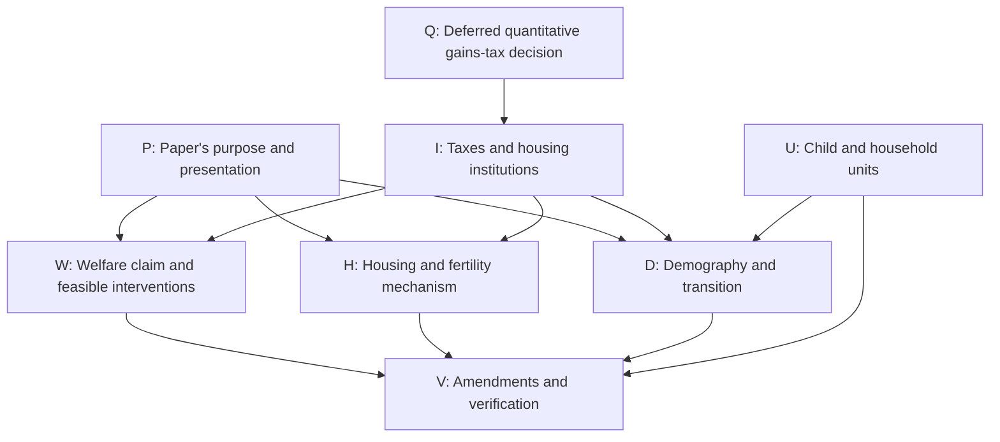

# Active Theory and Quantitative Decision Ledger

Updated: 2026-08-19

This is the short working ledger for the current paper. It records decisions
that can still change the theory, quantitative interpretation, or paper-facing
claims. `CALIBRATION_STATUS.md` remains the source for numerical results and
reproducibility contracts.

## Simplified theory discussion map

Started 2026-09-04 at Tommaso's request to explore the review's decisions one
at a time while retaining every branch. This section is the live record of
that discussion. The numbered register below remains background for earlier
theory and quantitative decisions; it has not yet been reconciled with the
independent review. No substantive author choice is inferred from reading the
review or agreeing to discuss it.

**September 5 author correction:** preserve the author's chosen notation,
separate flow utilities, explicit value functions, and variable names. The
amendment pass did not authorize replacing those conventions. Restore them
from the pre-amendment analytical section and appendix while retaining the
agreed economic amendments. This is a presentation correction, not a new
economic branch or acceptance of the remaining provisional choices.

**Latest execution and writing instruction:** Tommaso asked to work continuously
until done, with three checks of every substantive result; the hourly schedule
is now paused. He also asked for simpler, more transparent prose based on the
recent chats. Technical language should be used only when necessary. The
work record contains the three-check procedure and ongoing progress.

**September 5 author criterion: use the fertility/OLG literature's powers.**
Tommaso wants the authority grounded in established work and does not want to
invent a bespoke planner to obtain the desired result. This criterion is an
author instruction. The detailed transfer timing, eligibility, and initial-owner
arrangements in our construction are not thereby accepted.

The [reading guide](../../output/pdf/simplified_olg_efficiency_reading_guide.pdf)
now has a fourth page mapping relevant precedents to the proposed housing
benchmark. Auerbach--Kotlikoff provides the compensation method. Schoonbroodt
and Tertilt (2014, JET, sections 5.2--5.3) explicitly use public transfers, debt,
and taxes to overcome private intergenerational transfer constraints; their
mechanism concerns fertility and parent-child resources. They distinguish
implementing an efficient allocation from a Pareto improvement over the initial
allocation. Boldrin--Montes (2005, ReStud; official Fed abstract/publication
record checked) supplies the education-credit analogy for public financing
across a person's life. Bishnu, Garg, Garg and Ray (2023, JEDC, sections 4--5)
provide an endogenous-fertility education/pension example with lump-sum taxes
and period-by-period budget balance. These are precedents for the authority's
role, not proofs of our housing result or a single universally used planner.

For a direct fertility application of compensation, Okamoto's June 2021
working paper, Intergenerational Earnings Mobility and Demographic Dynamics,
section 3.1, was read: compensation of existing households, payments to future
households on entry, aggregate PV balance. Its subsequent 2022 publication
was verified, but the full-text version inspected is the working paper. Do not
claim that its per-capita welfare comparisons settle all variable-population
welfare questions. Fehr--Ujhelyiova's 2011 working paper compares stationary
policy outcomes; it is not evidence for complete-transition Pareto gains.

**Working recommendation:** a stated adaptation of the intergenerational-transfer
approach, with committed dated lump-sum taxes/transfers, public financing
subject to an explicit budget/solvency restriction, private housing/tenure/saving
choices and market clearing, the agreed physical restrictions, fixed individual
fertility, and lifetime welfare of initial claimants and all future cohorts.
Government financing may offset private credit constraints; unchanged mortgage
shares must not be presented as unchanged effective financing opportunities.
The original AK compensation timing is one payment to future households on
entry. Our before-purchase/old-age pair is not automatically equivalent when
liquidity constraints bind. Household/type eligibility, down-payment cash
eligibility, and initial-owner taxation/compensation must be mapped explicitly.
The passive outside title owner remains our accounting completion, not a
literature requirement. Next: assess the existing construction against this
named approach and isolate departures, rather than reopen a generic planner
menu. No model amendments or additional proof claims were made in this pass.

**September 5 proposed route back to the paper (not an author decision):**
the author asked for next steps that keep the expanding literature discussion
focused on the housing result. The desired claim remains: financial frictions
leave too little housing with young households, and a feasible reallocation
can improve welfare at fixed individual fertility. A fertility prediction and
population transition are separate subsequent results.

1. Use one focused discussion to settle the compensation benchmark. Recommended
   starting point: include initial claimants and all future cohorts in the
   lifetime Pareto comparison; retain physical/tenure restrictions; let prices
   and private choices adjust; allow specified committed lump-sum transfers with
   an explicit aggregate financing constraint. Explain that young grants backed
   by old-age taxes provide public financing even if mortgage rules are fixed.
   Future-tax enforceability, purchase-cash timing, and initial-owner fiscal
   participation remain choices, not accepted assumptions. Stop the literature
   detour once these questions can be stated and assessed clearly.
2. Reassess the existing conditional proof under the chosen benchmark. Its
   mathematical construction is already available; the task is to identify
   economically defensible necessary assumptions, simplify the statement, and
   establish exactly how broad it is. Separate housing/credit gains from any
   unrelated intergenerational saving mechanism. Do not repeat completed
   numerical checks without a changed assumption or unresolved concern.
3. Close issue 2 with a paper-ready proposition under accepted assumptions or
   a precise limitation. If the proposed constrained class cannot support a
   defensible result, explain the obstruction and the smallest economically
   motivated relaxation; do not broaden the model repeatedly to force the
   result. Retain the direct-allocation inefficiency result where valid without
   presenting it as a solved complete first best.
4. Then return to the fertility condition, analytical population transition,
   and the two requested conceptual figures. These remain distinct proof tasks.
   Quantitative magnitudes belong in the quantitative model. Population welfare,
   Diamond overaccumulation, and a general optimal-policy theory are parked
   unless the core housing argument needs them.

Keep one active question in this ledger: the financial powers of the
compensation planner. Other branches remain recorded; this proposed sequence
is not approval to amend the author manuscript or adopt new planner powers.

**September 5 literature detour (current discussion):** the author asked to
understand efficiency in OLG models before deciding the planner's powers.
Read the three-page [reading guide](../../output/pdf/simplified_olg_efficiency_reading_guide.pdf)
and its [source](../../latex/JMP_DS_suggestions/simplified_olg_efficiency_reading_guide.tex).
A full Pareto comparison includes initial old households and every future
cohort's lifetime utility. It does not require changing every cohort, and it
does not require a weighted sum of utilities. Comparing stationary allocations
alone does not evaluate transitional losses. Balasko--Shell distinguish
improvements changing finitely many agents from unrestricted comparisons;
one-time gifts are an instrument restriction, not the default OLG welfare test.

Auerbach--Kotlikoff, chapter 5, B.3, pp. 62--64, provides a closely relevant
hypothetical compensation authority: transfers are included in the equilibrium
transition and its account balances in present value. Its transfer timing and
public financing are not identical to our young/old cash construction. Bisin's
2014 lecture notes, section 3.2.4, guide the subsequent instrument discussion.
Diamond's overaccumulation result is distinct from our proposed housing
misallocation. Golosov--Jones--Tertilt's population-welfare definitions are
banked for later; fixed individual fertility avoids that additional comparison.
No new planner permission or welfare criterion has been accepted. The literature
does not independently certify the model-specific proofs. Start the next
conversation with the lifetime comparison and the small transfer example, then
discuss compensation across generations before returning to W1/W4/I1.

**September 5 focused constrained-efficiency pass (latest):** the author asked
to settle issue 2 before moving on. A complete local Pareto improvement is now
proved for a stated committed-transfer class: household-specific cash when
young and old, enforceable future lump-sum taxes, and a fully accounted passive
initial title owner with outside bond access and fiscal participation. Under
the stationary group structure, strict original constraints/tenure margins and
contraction condition, housing moves toward the young at every date; initial
young owners can gain strictly and nobody loses. Every future market clears.
The four-page [current note](../../output/pdf/simplified_olg_constrained_efficiency.pdf)
and [source](../../latex/JMP_DS_suggestions/simplified_olg_constrained_efficiency.tex)
contain the construction and resource identity. The two new reviews and
independent original-budget/optimization checks are indexed in
`output/model/simplified_olg_amendments/README.md`.

The same stationary regime has a local obstruction to one-time gifts with a
nearby converging continuation: its negative stable price root makes later
renter welfare alternate; the unchanged-tail case fails complete resource
accounting. This is not a global impossibility theorem. A separate finite
construction with a current-income advance and two housing incentives is kept
as an expanded-instrument fallback.

**Author choice remains OPEN (W1/W4/I1):** the research has established what
committed transfers can deliver; the author has not accepted future-tax
commitment, passive-owner fiscal jurisdiction/finance, or identity-based
eligibility. These permissions provide public financing across ages even with
unchanged mortgage shares. Do not present the result as inefficiency under
one-time gifts or as a pure price externality. Fertility is fixed individually
for this comparison. Real costs remain tentative; the optional threshold
requires an explicit date-specific cost base. The author manuscript is unchanged.
This result supersedes the older statements below that no complete-path theorem
had been established; those passages record earlier evidence.

**Earlier September 5 two-planner review (historical):** the author requested two Astra agents at
maximum reasoning, one per benchmark. Their bounded passes and the lead's
independent checks are complete. Read the five-page
[planner note](../../output/pdf/simplified_olg_planner_benchmarks.pdf), with
[source](../../latex/JMP_DS_suggestions/simplified_olg_planner_benchmarks.tex).
The direct current-goods compensation result is proved under its stated
permissions. Constrained inefficiency of the complete OLG economy is still
unproved; conditional examples do not settle it. Detailed findings below
supersede the earlier statement that the financed-sale construction is the
only developed allocation argument.

**Resume here:** the amendment proposal and verification are complete for the
agreed development pass. Read
[`simplified_olg_amendment_proposal.tex`](../../latex/JMP_DS_suggestions/simplified_olg_amendment_proposal.tex)
and its [PDF](../../output/pdf/simplified_olg_amendment_proposal.pdf).
The [work record](simplified_olg_overnight_work.md) contains all 14 repair
resolutions, the three-check record, numerical evidence, and remaining limits.
No hourly continuation is active. V0 is COMPLETE as a proposal and review pass;
that does not finalize provisional author choices or prove every desired claim.
Historical discussion-only passages below remain the record of the decision pass.

**Next discussion:** apply the author's literature-alignment criterion for
W1/W4/I1. Map the existing proof to the intergenerational-transfer approach and
isolate the housing-specific timing, eligibility and initial-owner assumptions.
The author has chosen the criterion, not every proposed instrument detail.
The direct-allocation benchmark remains available, and its complete first-best
estate-settlement question remains separate. W3's real cost is tentative;
U0's population interpretation and the two requested theory figures remain
banked. No hourly continuation is active.

**Established and qualified:** the fixed-fertility allocation result has an
explicit feasible compensated transaction. The fertility result has no
multiplier and has a price-free sufficient specialization at stationary prices
with zero property tax. The finite-reform continuation proposition has a short
conditional proof, but its model-wide hypotheses remain unproved. Four
illustrative credit cases retain property tax and show larger terminal
household populations; the largest initially lowers fertility through the
change in tenure shares. Neither the household theorem nor these examples
establishes a universally positive aggregate fertility response. All proposed
writing remains outside the protected author draft. Capital-gains taxation
remains deferred. The stronger constrained-efficiency benchmark was subsequently
reopened by the author; the latest committed-transfer theorem is stated
above with its unaccepted institutional permissions.

**Review evidence:**
[`simplified_olg_independent_review.tex`](../../latex/JMP_DS_suggestions/simplified_olg_independent_review.tex),
with its [19-page PDF](../../output/pdf/simplified_olg_independent_review.pdf).
The report is a dated assessment, not a record of accepted author decisions.
Retain it as the starting evidence; record later disagreements and resolutions
here rather than silently rewriting what the review said.

### September 5: efficiency benchmark and the role of numerical examples

**Author clarification:** efficiency can be assessed against a first-best
planner without requiring the planner's allocation to map into an actionable
policy. The planner's powers have not been fully settled, and Tommaso is still
thinking about them. The lead had placed too much weight on implementation when
assessing whether the efficiency result belongs in the paper.

**Record under W0/W1/W4/I1:** distinguish the planner's feasible allocations
and welfare criterion from the later policy instruments used to approach that
allocation. The existing compensated reallocation establishes a local Pareto
improvement under its stated permissions; it is not a completed characterization
of the first-best allocation. Keep that proof as evidence while reopening the
benchmark discussion. No welfare weights, new planner powers, or treatment of
institutional versus technological housing constraints has been chosen. The
stronger same-private-credit benchmark remains parked unless the author reopens it.

**Author view under D0/D1/P0/P1:** the small model's numerical example is useful
for internal understanding and checks, but is not the intended paper contribution;
the quantitative model will do the numerical work. Do not use the example as a
substitute for an analytical transition result or as the reason to retain the
theory section. Keep the saved examples and checks. Final figure placement and
the scope of the analytical transition statement remain open; no example is
removed and D1's broader research objective is not abandoned.

**Lead recommendation, not an author decision:** first settle which real
constraints and institutional restrictions bind the planner, and how existing
households' welfare is compared while fertility remains fixed. A Pareto
improvement can prove inefficiency without solving for a complete first-best
allocation or specifying a practical government transfer scheme. Any later
second-best policy still needs its own welfare assessment; following the
first-best direction alone is insufficient.

### Planner menu and the two theory figures — September 5

The author requested a menu of planner options and wants to recover two
conceptual figures: housing misallocation and adjustment to a new steady state.
The second should explain the theory, rather than display a simulated path.
The menu below is for discussion; no option has been chosen by requesting it.

**Feasible allocations, W1/W4/I1:**

| Option | Planner powers | Meaning and current status |
|---|---|---|
| A. First best at fixed fertility | Choose housing, consumption, and intertemporal allocations subject to the actual housing stock, endowments, external intertemporal resource feasibility, and any real costs or technological limits. Remove private financing and purely institutional access restrictions. Preserve preferences, including any tenure taste. | Broad efficiency benchmark. Subsequent author clarification retains tenure segmentation as a physical constraint; its exact feasibility conditions and treatment of other title restrictions remain to be specified. Does not authorize free resources or choosing additional births. |
| B. Planner who can overcome borrowing limits | Permit financing and the associated redistribution needed to reallocate housing, while retaining other specified tenure, housing-access, and estate restrictions. | Isolates credit as the source of the improvement. The present local proof supports this comparison under its stated permissions and slackness assumptions. It does not characterize the complete optimum. |
| C. Planner facing the same private constraints | Keep the mortgage financing share and physical housing restrictions fixed. Specify permitted cash transfers and their eligibility for down payments; households then choose and markets clear. | Stronger constrained-efficiency question, subsequently reopened by the author for transfers followed by market clearing. Which transfers count toward purchase cash remains to be specified. The financing marginal-value gap alone does not establish an improvement here. |
| D. Government choosing available policy instruments | Restrict interventions to specified taxes, subsidies, credit rules, or other instruments and their fiscal/market consequences. | Second-best policy problem for later quantitative work. It is not required to define or prove the theoretical efficiency benchmark. |

**Welfare criterion, separate from those powers:** a Pareto comparison asks
whether at least one household can gain while all others retain at least their
competitive-equilibrium utilities. A weighted-welfare planner selects an
allocation for specified welfare weights. The former establishes inefficiency
without choosing distributive weights; the latter characterizes a selected
first-best allocation, but its housing distribution depends on those weights.
Fertility, the households being compared, and real resource feasibility still
need to be specified in either case. Endogenous fertility/population welfare
remains outside this first comparison, in line with W0.

**Lead recommendation, not adopted:** A as the broad benchmark, evaluated
through a Pareto comparison with the competitive allocation. B can identify
how much of the inefficiency follows from borrowing restrictions alone. The
existing feasible improvement can rule out first-best efficiency if its
allocations are admissible under A, even before the whole first-best allocation
is solved. Preserve C as the parked stronger benchmark and D for policy work.

**Two-figure preference, P0/P1/D1:** recover the allocation and theoretical
transition figures as the intended visual organization. The first should show
the marginal housing values at the competitive allocation, the direction of
an improving reallocation, and the efficient allocation once it is derived for
the selected benchmark. A gap above real marginal reallocation cost supports a
local gain; an arbitrary curve crossing or shaded area is not a substitute for
that derivation. The second should link the initial steady state, impact with
inherited cohorts, demographic adjustment, and the new steady state. Its arrows
and endpoint ordering must follow the analytical conditions; do not assume a
monotone path or treat a two-variable projection as the complete dynamic system.
The replacement-fertility label remains $1/\nu$ in the present units.

References located and inspected:

- `latex/figures/fig6_ce_planner_wedge.tex` and `.png`: earlier crossing-value
  diagram, with obsolete price notation and an old-age tax wedge. Retain as a
  visual reference; it is not the selected model's verified first-best figure.
- `latex/figures/simplified_olg_reallocation_wedge.png`: later value-gap figure;
  its gains-tax terms belong to the deferred extension.
- `output/model/fertility_population_housing_transition_note/steady_state_comparative_statics.png`
  and `demographic_adjustment.png`: earlier linked population/housing-cost and
  fertility diagrams. Their builder uses a different illustrative household
  demand system, so equations and arrows cannot be imported unchanged.

The author's request supersedes the old audit's editorial recommendation to
keep exactly one figure. Its warning about an unproved transition shape remains
relevant. No old figure, manuscript, or builder was overwritten in this discussion.

### Planner allocations, prices, and tenure segmentation — September 5

**Author clarification under W1/I1:** the planner must respect physical
constraints, explicitly including tenure segmentation. Preserve this restriction
when defining the benchmark. The current model has one aggregate housing stock
and tenure-specific housing-size bounds; this clarification does not introduce
separate fixed rental and owner stocks or settle permissible tenure reassignment.
The author asks whether the planner should face prices and has not selected a
new welfare criterion or a market-based constrained-planner problem.

**Conceptual clarification and lead recommendation:** formulate the main
benchmark as a direct allocation of housing and consumption at fixed fertility
and cohort masses, retaining housing feasibility and segmentation while relaxing
private borrowing limits as already agreed. Domestic house prices and rents do
not enter as individual budget restrictions on this planner. Shadow values may
emerge from scarcity, and aggregate external intertemporal resource feasibility
still respects the economy's world borrowing/lending terms. A planner restricted
to interventions followed by market trade is a separate possible comparison;
it can anticipate the resulting price changes. It is not needed merely because
housing segmentation is retained. A Pareto comparison remains a recommendation,
not a newly accepted author decision. No formal planner program or manuscript
amendment is made in this discussion.

**Primary reference checked:** Alberto Bisin, *General equilibrium theory*,
lecture notes, November 4, 2014, Section 2.1 (printed pp. 4–5), formulates Pareto
efficiency using allocations, resources, and utility constraints. Section 3.2.4
(printed pp. 43–44) separately defines constrained efficiency with market trade
and a planner who anticipates the equilibrium price response. These are lecture
notes, not a new research result for this model.
[NYU source](https://bpb-us-e1.wpmucdn.com/wp.nyu.edu/dist/c/16384/files/2019/11/Lecture-notes-Oct2014.pdf).

### Both efficiency comparisons requested — September 5

**Author decision:** pursue both the direct-allocation benchmark and the
constrained planner who makes transfers and then allows markets to operate.
The desired second result is constrained Pareto inefficiency. This reopens the
stronger W1 branch; it does not establish that result or settle every transfer
permission. Keep physical tenure segmentation in both comparisons and retain
W0's fixed-fertility and fixed-cohort housing-welfare objective.

**What the existing proof establishes:** Proposition 1 in the amendment
proposal supplies extra purchase credit and directly arranges a compensated
housing transaction while holding prices and other allocations fixed. It does
not construct a new competitive equilibrium after cash transfers under the
original credit rules. Its marginal housing-value gap therefore does not prove
the requested stronger result.

**Specific issue checked in the household equations:** closing precedes income
and ordinary rebates, so $T_t$ does not enter the down-payment constraint. A new
net cash transfer $\ell_i$ paid before purchase and eligible for the down payment
would instead give $(1-\phi_t)P_t h_i\le b_i+\ell_i$, with the mortgage share
$\phi_t$ unchanged. This is a proposed transfer permission, not yet an author
choice or a change to the model. On a smooth, strictly binding owner branch,
starting from $\ell_i=0$, its local housing response is
$d h_i/h_i=d\ell_i/b_i-dP_t/P_t$. A price increase can therefore offset the cash
increase; no aggregate housing or welfare sign follows from the grant alone.
Transfers payable only after purchase do not directly change purchase cash.
Compulsory future repayment would introduce public credit and must be disclosed
as an additional power, rather than silently treated as an ordinary cash gift.

**Lead recommendation, not yet selected:** start with cash transfers balanced
across households and paid before housing purchases, retaining the mortgage rule
and physical segmentation. This changes the distribution of purchase cash,
without assuming a public loan with compulsory future repayment.

**Next proof task:** select the admissible cash-transfer schedule and resource
budget; keep mortgage and housing restrictions explicit; derive household and
market-clearing responses; and check the welfare of every affected household,
including sellers, other buyers, and later cohorts if future prices change.
A constrained Pareto improvement requires everyone weakly better off and some
strictly better off. Improved weighted welfare or a gain for young households
alone is insufficient. No general constrained-inefficiency theorem is claimed.
Bisin Section 3.2.4 supplies the conceptual definition, not a theorem applying
automatically to this deterministic housing economy.

### Two Astra reviews and lead verification completed — September 5

**Execution:** the author explicitly requested two Astra agents at maximum
reasoning. One derived the direct-allocation result; the other investigated
cash transfers followed by markets. Separate evidence files, a 20-minute
first-pass limit, and lead synthesis were specified before dispatch. Both
returned completed reports; no workers or automatic continuation remain active
for this pass. The earlier one-worker default in the overnight plan was
superseded by this explicit request.

**W0/W1 direct result:** giving an eligible old owner exact current-goods
compensation $D_j(\epsilon)$ and reducing young current consumption by
$D_j(\epsilon)+C(\epsilon)$ proves a local Pareto gain when
$MV_i^Y>MV_j^O+K$. This avoids an interior-saving Euler condition in the basic
allocation proof. Original title, estate, fiscal, and external-claim accounting
was reconciled; the net external asset path is unchanged. The CE corollary
still needs the stated household interiority/slackness and a positive measure
of eligible pairs. Neither every weighted optimum nor a global first-best
allocation is characterized.

**W1/W4 constrained result:** a finite-neighborhood obstruction was proved for
the conditional cash-transfer problem using the signs of aggregate exact
compensation and compensated housing demand. A fully specified current-date
example satisfies the obstruction despite a strict financing gap. The saved
illustration instead admits an exact improvement for four current household
groups, but moves housing toward the old. It fixes continuation prices and
local tenure/constraint branches, does not clear future markets, and omits the
welfare of initial intermediary title owners. It is not a complete-economy
constrained Pareto improvement or a theorem for an OLG transition. Preserve
these calculations as internal evidence, in line with the author's preference.

**I1/W4 remaining choices:** specify ultimate initial title ownership and whose
welfare is covered; a single date or committed sequence of cash transfers;
transfer targeting and purchase-cash eligibility; and estate settlement in a
global first-best problem. Public credit or compulsory later repayment is an
additional power, not silently part of a cash gift. These choices remain open.

**P1 figure:** exact compensated marginal-value curves were derived for the
two-household, fixed-continuation Pareto problem. A crossing is that restricted
optimum, not the whole economy's first best. No old figure was overwritten and
no transition result was developed in this pass.

**Verification:** direct derivation, original-equation/accounting checks, and
independent finite perturbations/boundary review. The lead driver
`code/model/tools/verify_simplified_olg_planner_benchmarks.py` verifies 27 direct
perturbations, three exact conditional cash examples, and the obstruction's
household conditions and coefficient signs. No model/calibration solve ran.
Reports and receipts are indexed in
[`output/model/simplified_olg_amendments/README.md`](../../output/model/simplified_olg_amendments/README.md).
The five-page PDF compiled twice without layout/reference warnings and every
page was visually inspected. The protected manuscript and active solver were
not edited.

### Progress count and remaining discussion topics

The map retains **18 entries**: **10 agreed directions** (P0, W0, W1, I0,
H0, H1, D0, D1, D2, P1), **3 parked branches** (W2, Q0, Q1), **4 unresolved
author/specification entries** (W3, W4, I1, U0), and **1 completed development
pass** (V0). W3 remains tentative and W4 is reopened. Agreed directions are not proof
certificates: D1's interval-wide assumptions and general policy signs remain
visible proof obligations. The stronger constrained-efficiency benchmark is now
an active alternative within W1, not a nineteenth entry. Its transfer rules and
proof remain open; the three parked IDs above are unchanged.

The next topic is the planner benchmark (W1/W4/I1), followed by real costs
(W3) and literal population units (U0). The 14 review repairs below are work obligations,
not 14 additional author decisions; each now has a resolution in the work record.

### How to use and maintain this map

- Give each question a stable ID. Record new branches when they arise; do not
  erase alternatives merely because the conversation follows another branch.
- Discussion status is **OPEN**, **ACTIVE**, **TENTATIVE**, **DECIDED**,
  **PARKED**, **REOPENED**, or **COMPLETE** (for finished work). A tentative preference is not an author decision.
  A parked branch needs a reason and a condition for revisiting it.
- Keep three objects separate: what the evidence supports, what Tommaso
  chooses, and what has actually been amended and verified. A mathematical
  claim is not made true by a vote, and agreement to a claim is not a code check.
- For each developed node retain: exact question; alternatives; assumptions;
  evidence and unresolved objections; lead recommendation; author's choice in
  his own words with date; dependent nodes; and amendment/verification status.
  Initially the table records the question and dependencies; expand its node
  when discussed instead of creating a separate note for every question.
- At a detour, record the suspended question and return point in the traversal
  record. Cross-links matter: choices about taxes, institutions, and population
  change the obligations on several other branches.
- When an upstream choice changes, mark affected downstream decisions
  **REOPENED** or **needs recheck**, with the reason. Preserve the prior choice.
  Never silently carry a result into a different feasible set or target claim.
- After each substantive exchange, save a short delta: settled; still open;
  newly created branches; and next question. Save before ending the turn and
  before drafting amendments. Read this section when resuming the discussion.
- **Current author instruction:** proceed with the consolidated plan and
  overnight development authorized on 2026-09-04. Preserve prior decisions and
  provisional qualifications. The work plan above records the scope, limits,
  deliverables, and checkpoints; do not treat historical discussion-only
  passages as a new veto, or development permission as final acceptance of W3/W4.
- Draft agreed manuscript changes in `latex/JMP_DS_suggestions/`. Close an
  amendment only after checking the relevant prose, equations, code, and claim
  ledger together. The protected manuscript remains author-controlled.

### Branch overview

The arrows indicate dependencies to revisit, not a mandatory reading order.
The map permits multiple retained contributions; it does not force a choice
between mechanism analysis and welfare analysis before either is understood.

| ID | Question and retained alternatives | Status | Dependencies / consequences | Review evidence |
|---|---|---|---|---|
| P0 | Main-text theory presents the allocation-efficiency result, conditional fertility prediction, and transition/terminal-population implications. The author agrees but treats presentation as low priority now. | DECIDED | Preserve W0's economic objective; defer detailed presentation work. Actual claims remain bounded by what is established. | Sections 1, 6, 8, 10; P0/P1 author agreement below |
| W0 | Desired result: equilibrium inefficiency, demonstrated by a planner reallocating housing toward young households without relying on fertility benefits; fertility effects are a subsequent claim. | DECIDED | Research objective only. Feasible set remains W1; compensation, welfare population, and criterion remain W4. Truth and generality are not decided by the objective. | Sections 3-4; W0 discussion below |
| W1 | The direct-allocation planner may relax private borrowing limits. Also pursue constrained inefficiency with transfers followed by market clearing; the author reopened this stronger branch on September 5. | DECIDED | Keep the two feasible sets explicit. The existing financed transaction supports the first comparison, not a constrained-efficiency theorem. Retain segmentation; specify transfer timing, funding, purchase-cash eligibility, and all affected households before testing the second. | Section 4, A-B; W1 discussion below |
| W2 | The gains-tax/common-rebate construction is deferred with the gains-tax extension. Preserve the zero-cost result, eligibility qualifications, and unresolved implementation questions. | PARKED | Revisit through Q0/I0. A tax-revenue result for unconstrained buyers remains distinct from the core financing result. | Section 4, C; I0 discussion below |
| W3 | Provisionally include a reduced-form nonnegative real reallocation cost in the working theoretical benchmark. Exact functional form, incidence, and numerical value remain open. | TENTATIVE | Author accepts proceeding with the recommendation with a "we'll see" qualification. Review the specification later alongside W4's compensation scheme. Keep fixed and marginal costs distinct; the gains-tax/common-rebate extension stays deferred. | Section 4, cost extension; W3 author response below |
| W4 | Define the planner welfare criterion and permissible redistribution at fixed fertility. The earlier household-specific compensation benchmark remains a possible proof construction. | REOPENED | September 5: settle feasible allocations and welfare coverage before choosing an implementation scheme. A practical policy is not required for the efficiency benchmark. Preserve the prior provisional choice and the proved compensated construction; no new criterion or transfer power is selected. | Sections 4, 6; September 5 clarification; earlier W4/I1 author response below |
| I0 | Keep the core allocation result based on borrowing constraints. Realized capital-gains taxation is a deferred extension, to revisit when deciding whether to include it in the quantitative model. | DECIDED | W2 and gains-tax-specific transition work are parked. Property taxation is a separate instrument. The proposed core and new verification override gains tax to zero; the historical builder and evidence remain unchanged. | Sections 5-6, 8; I0 discussion below |
| Q0 | Should realized capital-gains taxation enter the quantitative model, with the necessary institutional, empirical, and state-variable justification? | PARKED | Author's explicit return condition for the gains-tax extension. If this decision becomes active, revisit I0/W2 and relevant D1-D2 obligations. No quantitative implementation or run is authorized by this deferral. | I0 author statement below; live quantitative contract remains in CALIBRATION_STATUS.md |
| Q1 | Can the housing-access mechanism generate an independently testable quantitative prediction for a specified housing policy? | PARKED | The author clarified that he currently wants H0's analytical threshold, not an empirical-validation design. Retain this separate lead suggestion; revisit if external validation becomes a requested paper objective. No policy or new calibration target is imposed. | Q1 discussion below; H0 threshold clarification |
| I1 | Which baseline institutions are intended? External bond trade, closing chronology, common rebates, renter size limits, owner title/occupancy restrictions, and estate treatment. Clarify existing restrictions or explicitly choose changes. | OPEN | September 5: retain tenure segmentation as a physical constraint on the planner. Its exact feasibility conditions and broader institutional choices remain open. The proposal records the dated institutions and one explicit planner transaction. Keep inherited entrant wealth distinct from warm-glow estate utility. | Sections 2, 6-7 |
| H0 | Pursue an analytical restriction for higher fertility, preferably entirely in primitives and especially without the multiplier $\zeta$. The existing formulas are derivation evidence, not the selected final proposition. | DECIDED | A local payment condition and a primitive sufficient restriction in a stationary zero-property-tax specialization have been derived and checked under V0. General-equilibrium policy signs remain open; return to W1/W4/I1 for incidence and to H1 for a quantitative analogue. | Sections 3, 6, 8; H0 threshold clarification and preference below |
| H1 | Retain the simple model's one-shot completed-fertility choice in its two-period OLG structure; leave sequential birth timing and childlessness to quantitative work. | DECIDED | Fertility-architecture scope only. Log utility, goods/space requirements, tenure tastes, and maintained old-age branches remain assumptions to assess where relevant; do not infer blanket approval. P0/H0/I1/V0 remain dependencies. | Sections 2-3, 6, 8; H1 author response below |
| D0 | Compare fertility and population along the transition, and total population in the new steady state. A permanently higher stationary fertility rate is not the requested outcome. | DECIDED | Author's comparison scope only. Illustrative common-initial-state paths and terminal household comparisons are checked. General signs and model-wide convergence remain open under D1-D2; literal-person measurement remains U0. No quantitative endpoint is certified by this decision. | Sections 5-6, 8; D0 author decision below |
| D1 | Aim for the broadest valid transition result under economically reasonable, transparent conditions; do not restrict the objective to small reforms in advance. | DECIDED | Research objective only. Mild restrictions are the author's expectation, not an established fact. Separate existence, convergence, and uniqueness; retain local scope as a fallback. A conditional finite-reform continuation proof is complete; its aggregate smoothness, bounded feasibility, and local-uniqueness assumptions are not established over the full model policy interval. | Section 5; D1 author preference below |
| D2 | Supply scope: fixed stock as the simple-model benchmark, with a simple long-run supply extension to assess the terminal population claim. Exact supply specification, transition construction, shock direction, branch coverage, and numerical scope remain open. | DECIDED | Stationary supply accounting is checked; no supply function or construction dynamics are selected. The new credit examples retain property tax and have separately verified paths. Historical gains-tax examples remain evidence; tax-specific work stays deferred with Q0. | Sections 3, 5-6; D2 author agreement below |
| U0 | Reconcile the recorded mismatch between toy fertility, literal children, entrant households, and total population labels. Retained as a correction for the later amendment plan; no new normalization selected. | OPEN | The change-of-variables correction is derived and verified: mapping 0.5 to 2.1 requires a factor 4.2. Literal-child and resident-person conventions remain author choices. Existing quantitative units remain unchanged. | Section 3, details behind audit; U0 correction note below |
| P1 | Agreed broad division: environment/equilibrium, allocation, conditional fertility, and transition/population implications in the main text; detailed proofs in the appendix. Preferred visual structure: one misallocation figure and one theoretical transition-to-steady-state figure. | DECIDED | September 5: recover the two conceptual figure roles, with notation and geometry derived from the chosen model. Exact figure version, axes, conditions, and placement remain open. Simulated paths are not the intended second figure. | Sections 7-8; P0/P1 author agreement; September 5 planner menu and figure preference |
| V0 | Implement and verify the agreed directions under the consolidated overnight plan; reconcile section, appendix, builder, and claim ledger, with suggestions outside the protected draft. | COMPLETE | Consolidated proposal, checks, independent reviews, PDF, and 14-row reconciliation delivered. Preserve W3/W4 as provisional and the stated unproved transition/global-policy claims; see simplified_olg_overnight_work.md. | Section 9; overnight authorization |

### Corrections and verification work retained across branches

These rows retain every action in the review's 14-row priority ladder, in its
original order. The development pass is **complete as a proposal** under V0; author
choices and completed verification remain separate from implementation status. Rows described as
corrections can be checked independently; they do not require choosing facts.
Their eventual inclusion and implementation must match the selected claims.

| Review priority row | Action to retain | Governing nodes |
|---|---|---|
| 1 | Separate baseline feasibility from the value of added closing credit. | W0-W1 |
| 2 | Repair the positive-cost/common-rebate sufficiency claim or omit that extension. | W2-W3 |
| 3 | Bound numerical transition and quantitative endpoint claims by the evidence actually available. | D0-D1 |
| 4 | Role decided: deferred extension, tied to the quantitative inclusion decision. Reflect this in the core source when amendments begin. | I0, Q0, P0 |
| 5 | Distinguish young-only from common-cap derivatives and include the old-rent resource effect. | H0 |
| 6 | Reconcile toy child units, replacement, and the literal-child mapping. | U0 |
| 7 | Consolidate equilibrium; state external finance, timing, and title/occupancy restrictions. | I1, P1 |
| 8 | Separate finite-shock Jacobian diagnostics from zero-shock theorem hypotheses. | D1-D2 |
| 9 | Include acquisition basis in terminal checks and threshold reported positive gains dates. | D2 |
| 10 | Put the useful fertility comparative static near the mechanism; shorten the branch catalogue. | H0, P1 |
| 11 | Choose transition-figure size/location and whether to retain the wedge figure. | P1 |
| 12 | Test additional corners only if broader solver coverage is required; retain current-example checks. | H1, D2, V0 |
| 13 | Consider existing-household consumption-equivalent policy welfare under specified fiscal/credit rules. | W1, W4 |
| 14 | Decide whether an exact infinite-horizon result warrants the required work. | D1, P0 |

The full 30-row formal audit remains the evidence inventory in review Section 3.
This map groups its decisions and work obligations rather than treating every
valid algebraic identity as a fresh author choice. Revisit its affected rows
whenever a primitive, branch, or theorem scope changes.

### Source discrepancies to resolve explicitly

- **W2-W3:** the pre-discussion working-tree welfare entry states sufficiency of
  $\ell_t>\bar K_t$ with a common rebate. The independent review contests
  that extension without an incidence/financing condition and supplies a
  counterexample. Retain the zero-cost result and positive-cost extension as
  separate claims while discussing them; do not cite the earlier sentence as
  settled evidence.
- **U0:** the earlier child-unit entry calls the mapping resolved. The review
  notes that the toy example's $\nu=2$ implies replacement $n=0.5$; the
  additional mapping of one toy child unit to 2.1 literal children would then
  imply 1.05 literal children per toy household. The interpretation of that
  combination remains open. This does not change the live quantitative
  divisor on its own.
- **D1:** the earlier transition register uses language about a transition
  between steady states. Keep the computed terminally closed approximation
  distinct from a proved exact infinite path and from the quantitative model.
- **Quantitative boundary:** earlier numbered points contain historical fit
  values and a supply-elasticity recommendation superseded by the September 4
  `CALIBRATION_STATUS.md`. Use that status file for the live contract. No
  calibration choice is made through this theory discussion map.

### W0 discussion: author objective and next fork

**Author statement, 2026-09-04:**

> The claim I would like to be true is that the eq. is inefficient, in the sense that a central planner would reallocate hosuing to young people. this is without considering fertility outcomes preferences, just int erms of marginal utyiliy of housing. on top of hat it would be good to claim fertility effects.

**Recorded choice:** pursue an allocation-efficiency result first and assess
fertility effects separately. Do not treat the desired claim as already true,
as an instruction to manufacture it, or as agreement to arbitrary welfare
weights or a particular financing instrument.

**Working interpretation, to retain explicitly:** hold fertility and cohort
masses fixed in the first allocation comparison. Existing children's space
and goods requirements can remain in preferences. This is not a decision to
set the child-space requirement or the fertility-preference parameter to zero.
Which households must be protected, and whether the statement is Pareto or
uses specified social weights, remain questions under W4.

**Economic distinction for discussion:** raw marginal utilities across people
do not provide a utility-normalization-invariant efficiency test. Use the
marginal rate of substitution $m_i=U_{h,i}/U_{c,i}$, meaning the household's
marginal housing valuation in units of consumption goods. At the maintained
steady-state branches, the existing appendix gives
$m_Y-m_O=\zeta^{O,F}>0$ for a young owner with a positive financing wedge and
an interior old incumbent. This establishes a valuation gap for that pair,
not a universal age ranking or a feasible welfare improvement by itself.
Source: `latex/simplified_olg_paper_theory_appendix.tex`, equations
`eq:olg_app_young_mv` and `eq:olg_app_old_mv`.

A local zero-cost exchange illustrates the required proof: for
$m_O<a<m_Y$, transfer $\epsilon$ units of housing services from old to young,
reduce the young household's goods by $a\epsilon$, and increase the old
household's goods by the same amount. Holding fertility and continuation
allocations fixed, the first-order utility changes are
$U_c^Y(m_Y-a)\epsilon>0$ and $U_c^O(a-m_O)\epsilon>0$.
This illustrates resource-feasible gains when that service-and-goods exchange
is permitted; it does not by itself verify the model's durable-title, estate,
lending, and fiscal implementation. Those remain W1/I1 obligations.

**Lead recommendation at the W0 exchange:** explore a Pareto improvement
relative to a planner who can reallocate real resources and overcome private
financing limits. This is a legitimate resource-feasible benchmark, though
it does not establish constrained inefficiency under the original closing
rules. A planner facing a microfounded enforcement or information restriction
must respect that restriction if it is part of the maintained feasible set.
Do not infer that every weighted planner optimum necessarily raises aggregate
young housing from the existence of one local improving transfer.

The basic welfare distinction between Pareto improvements and changes in the
distribution along a Pareto frontier is also explained in
[Robert Townsend's MIT welfare-theorems lecture](https://ocw.mit.edu/courses/14-04-intermediate-microeconomic-theory-fall-2020/1gcajw7hbthjPcO8f8wCXWoKIBXEYkUEH_transcript.pdf).
This is background for the criterion, not evidence for the project-specific
reallocation theorem.

**Question raised at this exchange:** may the planner overcome the private
financing constraint, or must the desired inefficiency result survive that
same constraint? The subsequent W1 entry records the author's answer.
**Return point:** once W1 and the relevant W4 conditions are settled, identify
the smallest valid allocation proposition. Then return to H0 for the fertility
response; an allocation improvement does not by itself sign that response.

### W1 discussion: financing permission adopted

**Author statement, 2026-09-04:**

> I think it's fine to think that the palnner can relax the oborrowing limits. the stronger requirement would be nice, but i think for now we can do.

**Decision:** the current planner benchmark may overcome private borrowing
limits. This answers the financing fork only; it does not waive real resource
costs, outside lenders' claims, or the need for a complete feasible allocation.
The allocation-efficiency objective and the separate fertility extension remain.

**Originally parked; reopened September 5:** prove constrained inefficiency
with transfers followed by market clearing and explicitly retained private
credit rules. The paragraph below records the original deferral, superseded by
the author's later request to pursue both benchmarks. The original alternative
was to prove constrained inefficiency with the original borrowing rules retained. It remains desirable, not rejected. Revisit if the
paper requires an intervention feasible under those rules, or after the core
allocation result and its policy interpretation are settled. The gains-tax
result under W2 remains a distinct possible route within that alternative.

**Proof route carried forward by the lead:** use the compensated Pareto
comparison proposed in W0. The old household must be compensated for the lost
space and any relevant estate consequences; the young household's gain must
remain positive after repayment, compensation, and real costs; outside
lenders and unaffected households cannot finance the gain through losses.
Fertility remains fixed for this comparison. The precise transfer dates and
welfare coverage must be specified in the eventual proof. No arbitrary social
weights or additional benefit from births are needed for this proof route.

Under the existing appendix's maintained interiority and transfer assumptions,
the steady-state valuation gap is $m_Y-m_O=\zeta^{O,F}$. If $K$ denotes the
marginal real cost of reallocating housing, the local sufficient inequality is
$\zeta^{O,F}>K$. This identifies why a financing-based result can be developed
without realized capital-gains taxes; it is conditional on the complete
implementation assumptions, not established merely by the author's choice.
No cost value, tax removal, or general first-best planner optimum has been
adopted here.

**Question raised for I0:** should the core allocation result be established using the
financing friction, with realized capital-gains taxation considered separately?
The lead recommends that separation to isolate the mechanism and obtain a
steady-state result. The subsequent I0 entry records the author's decision.
Property taxation is a different instrument; this question does not imply
removing it.

### I0 discussion: capital-gains extension deferred

**Author statement, 2026-09-04:**

> i agree with your recommendation. we should leave it as extension and defer that to when we decide whether to put it in the quant model or not

**Decision:** the core allocation result uses the borrowing friction. Realized
capital-gains taxation remains an extension, deferred until the author
considers whether to include it in the quantitative model (Q0). This is not
permanent rejection and not a decision to add the tax to the quantitative
model. The quantitative contract and the property-tax instrument are unchanged.

**Dependency update:** park W2, the gains-tax-specific part of W3, and the
gains-kink/basis/gains-date work within D1-D2. Preserve their objections and
conditions for the return to Q0. General transaction costs, compensation,
demographic propagation, and transition verification remain relevant. The
existing sources still contain gains taxation; their later reconciliation
must implement this author decision without deleting the retained extension.

### H0 discussion entry: connect the fertility effect to an intervention

The next open question is which intervention the fertility claim follows.
The lead recommends evaluating the same compensated reallocation used in the
efficiency comparison, with its financing and compensation rule stated. A
pure borrowing-limit change and a funded equilibrium policy remain distinct
alternatives, as do a young-only cap change and a common rental-cap change.

The existing derivative in `latex/simplified_olg_paper_theory_appendix.tex`,
`eq:olg_fertility_derivative`, holds effective resources, user cost, tenure,
and the old-age branch fixed while raising the current housing limit. It
balances a positive space effect against the goods cost of additional housing.
It does not by itself describe a compensated planner transfer, whose payment
rule can also change effective resources. Nor does a Pareto improvement at
fixed fertility establish a positive fertility response. Derive the response
for the chosen intervention; do not copy the cap derivative or its sign into
the welfare theorem without reconciling those objects.

**Clarification requested, 2026-09-04:**

> can you clarify the consequenes of the decision? I am not sure, but I would expect fertility to increase under both?

**Correction to the earlier framing:** the alternatives are not inherently
exclusive and need not have different signs. With identical realized housing,
net resources, preferences, tenure, and the relevant old-age branch, the
household has the same conditional fertility problem regardless of whether
those inputs arise through a planner's arrangement or a credit policy. The
author's expectation of positive effects under both is a hypothesis to assess,
not a decision imposing their sign. No choice between the two is recorded.

**Common local calculation.** Let $R_{\rm net}$ be effective lifetime resources
left after net housing expenditure and transfers. Write $\rho=1+k>0$ for the
coefficient on usable consumption $x$, and $s=h-\kappa n$ for adult space.
On a maintained branch, with transfers independent of the fertility choice,
the budget and fertility condition are
\[
 \rho x+\chi n=R_{\rm net},\qquad
 \frac{\vartheta}{n}=\frac{\chi}{x}+\frac{\alpha\kappa}{s}.
\]
Define the positive curvature term
$\Delta=\vartheta/n^2+\chi^2/(\rho x^2)+\alpha\kappa^2/s^2$.
Differentiating gives
\[
 dn=\frac{\alpha\kappa}{s^2\Delta}\,dh
   +\frac{\chi}{\rho x^2\Delta}\,dR_{\rm net}.
\]
Thus extra housing at unchanged net resources raises fertility, and extra net
resources at fixed housing also raise fertility. Housing that must be paid
for can combine a positive space effect with a negative resource effect.
If $p=-dR_{\rm net}/dh$ is the net marginal resource cost to the young
household, including the chosen payment rule, then
\[
 \frac{dn}{dh}=
 \frac{\alpha\kappa/s^2-\chi p/(\rho x^2)}{\Delta}.
\]
For the original pure cap relaxation at fixed prices and effective wealth,
$p=u$, the housing user cost. A planner's financing/compensation arrangement
can have that same $p$, or a different one; calling it a planner intervention
does not make housing free. A grant needs a funding source in the full
feasibility comparison. This calculation allows the household's usual
within-branch consumption/saving reoptimization; it is not yet a complete
planner implementation or a general-equilibrium policy derivative.

**Check of the absence of a universal positive sign.** An illustrative reduced
household point has $\rho=2$, $\alpha=\chi=x=s=n=1$, $\kappa=0.1$,
$\vartheta=1.1$, and $u=0.5$. It satisfies the fertility condition, has
$h=1.1$, effective pre-housing resources $3.55$, and a positive housing-access
wedge $\alpha x/s-u=0.5$. With $p=u$, $dn/dh=-15/161<0$, even though the
young household's goods-equivalent marginal welfare gain is $0.5$. With
$p=0$, the derivative is $10/161>0$. These are didactic conditional-household
calculations, not calibrated results or a constructed equilibrium. The FOC,
positive wedge, and derivative were checked using exact rational arithmetic;
central differences of the FOC agree with the implicit derivative to less
than $10^{-10}$. The example establishes that a positive access wedge or a
private welfare gain alone does not prove a positive fertility response.

**Consequence for the research design:** derive the common household sign
condition first and assess whether the intended example satisfies it. Then
state which financing and compensation arrangements deliver the required
housing and net resources. A policy additionally requires endogenous prices,
tenure responses, and fiscal closure to determine aggregate fertility. The
lead recommends treating the planner allocation and its possible policy
implementation as related stages, not asking the author to choose between
them before specifying these objects. H0 remains active.

### H0 clarification: the author wants an analytical threshold

**Author clarification, 2026-09-04:**

> i am saying a simpler thing.
> there is a model implied prediciton that says something lik e'if parameter x is greatter than y+z, we get it'

**Correction to the lead's interpretation:** the immediate request is for a
conditional analytical prediction expressed as an inequality, not an external
policy-validation design. Return to H0 and park the lead's additional Q1
suggestion. Extending such a condition to the quantitative model remains a
possible later task; no numerical run or parameter change is requested here.

**Exact local restriction already present in the appendix.** Let $u>0$ be
the housing user cost, $\zeta\geq0$ the housing-access wedge, and
$\rho=1+k$ the reduced consumption weight. The housing condition is
$\alpha x/s=u+\zeta$. For a pure relaxation of the binding current housing
limit, with prices, effective wealth, tenure, and the old-age branch fixed,
\[
 \frac{\partial n}{\partial\widehat h}>0
 \quad\Longleftrightarrow\quad
 \rho\kappa(u+\zeta)^2>\alpha\chi u.
\]
This follows from `eq:olg_fertility_derivative` and `eq:olg_fertility_sign`
in `latex/simplified_olg_paper_theory_appendix.tex`; the latter writes the
weak-sign condition on the interior old-age branch. Here $\kappa$ is space
required per child, $\chi$ the goods requirement per child, and $\alpha$
the young household's housing utility weight. On the interior old-age branch,
$\rho=1+\beta(1+\gamma+\omega_B)$; on the maintained capped-old-renter branch,
$\rho=1+\beta(1+\omega_B)$, for a young-only housing-limit change.

**A simpler sufficient restriction.** Since $u+\zeta\geq u>0$,
\[
 \frac{\kappa u}{\chi}>\frac{\alpha}{\rho}
 \quad\Longrightarrow\quad
 \frac{\partial n}{\partial\widehat h}>0.
\]
The left side compares each child's required housing-space cost with the
goods requirement; the right side is a relative preference weight in the
reduced lifetime problem. This condition removes the endogenous access wedge
from a sufficient test, but $u$ is still an equilibrium price object. It is
not an if-and-only-if primitive-parameter restriction. Failure of this stronger
condition does not imply a negative response; the exact condition may still
hold with $\zeta>0$. At a slack limit, relaxing the limit has no access effect.

**Connection to the compensated-reallocation branch.** At the same initial
allocation let $m=\alpha x/s=u+\zeta$ and let $p=-dR_{\rm net}/dh$ be the
young household's net payment per extra unit. The general exact threshold is
$p<\rho\kappa m^2/(\alpha\chi)$. The sufficient restriction above also
implies a positive conditional fertility response for any marginal payment
$p<m$ that leaves the young household better off, within this same reduced
household problem. This does not verify dated compensation to the old, real
costs, lender claims, or unaffected-household welfare; those remain W4/I1/W3.

**Verification and scope:** exact rational checks over 216 parameter/wedge
combinations verify the numerator identity, sufficient restriction, and general
payment threshold. These are algebra checks, not model simulations or evidence
that the calibrated model satisfies the condition. A quantitative analogue
must be derived from its own preferences and discrete fertility choices;
aggregate price and composition effects remain separate.

**Author preference and traversal instruction, 2026-09-04:**

> of course the best if it it does not involve equilibrium object, but even more specifically not a fan of the condition having the multiplier zeta inside. but anyway, you gto way i mean. let's move forward and then we'll plan

**Settled direction:** prioritize a condition in primitives; especially avoid
an endogenous multiplier in the presented condition. The author expresses a
preference for excluding all equilibrium objects, not approval of the existing
user-cost restriction as the final theorem and not a claim that a useful
primitive-only restriction must exist. Preserve both calculations as working
evidence. Defer further derivation and implementation planning, continue to
the next substantive issue, and return to H0 when assembling amendments.

### D0 discussion: transition fertility versus stationary fertility

**Next issue raised by the lead:** decide the intended time horizon of the
fertility claim. The simplified model's cohort law is
$Y_{t+1}=\nu\bar n_tY_t$, where $Y_t$ is young-household mass,
$\bar n_t$ is average completed fertility of that young cohort in toy units,
and $\nu$ converts those units into next-period young households. Consequently,
any positive stationary population satisfies $\bar n^*=1/\nu$. A policy that
leaves $\nu$ and this demographic closure unchanged cannot produce two positive
stationary endpoints with different average fertility. This is an accounting
restriction, not proof that either endpoint exists, and not a statement that
fertility cannot respond during a transition. Sources:
`latex/simplified_olg_paper_theory_section.tex`, cohort law and
`eq:olg_steady_state_system`; the appendix's steady-state proof.

**Consequence to discuss:** a permanent housing reform can affect the fertility
of transitional cohorts and the eventual population level, housing allocation,
and distribution of fertility across types. These possibilities do not imply
a permanently higher average stationary fertility rate, nor do they establish
the sign or duration of the transition response. Literal-child conversion
remains U0; no numerical replacement normalization is selected here.

**Lead recommendation, not yet an author decision:** retain the current
demographic accounting and frame the policy fertility claim along the
transition. If a permanently different long-run fertility rate is essential,
reopen the demographic setting explicitly (for example a growing population
or an open population), with its own housing and population consistency
requirements. No change to the toy or quantitative closure is made here.
W4/I1 compensation and W3 real-cost questions remain open while D0 is discussed;
moving to this issue does not settle them.

**Author decision, 2026-09-04:**

> no, clearly, yeah. what i want is comaprison along transitoin, and comparing the total ppulation level in the new ss.

**Recorded scope:** compare fertility and population along the transition and
compare total population at the new steady state. The author does not seek a
permanently higher stationary fertility rate. This settles the comparison
objects, not the sign of the terminal population effect or the existence and
attainability of a positive new endpoint. Preserve D1-D2's proof and numerical
obligations and the live quantitative status; no new steady state is certified
or imposed by this discussion. The working policy comparison uses a common
initial state and common non-policy shocks, with the exact policy deferred.
The toy model directly counts young and old households; mapping the requested
total population to literal persons remains explicit under U0.

### D2 next issue: housing stock in the long-run comparison

The simple model holds total housing stock $\bar H$ fixed. At stationarity,
$Y^*=O^*=\bar H/(\bar h_Y^*+\bar h_O^*)$, so its adult-household population
is $Y^*+O^*=2\bar H/(\bar h_Y^*+\bar h_O^*)$. For unchanged stock, a larger
stationary household population must therefore be accompanied by lower
average housing use per household. Source: the section's
`eq:olg_steady_state_system`; review Section 6 discusses this long-run
restriction. This is an accounting implication, not a signed policy result
or a measure of literal resident persons.

**Lead recommendation, not yet adopted:** retain fixed stock for the simple
model's allocation mechanism and assess supply adjustment in the quantitative
model. The alternative is to add endogenous construction to the theory,
requiring an explicit supply technology and its own equilibrium conditions.
This next discussion does not authorize either amendment or change the live
quantitative supply specification. W4/I1 compensation, W3 costs, and D1
transition existence remain open while this issue is considered.

**Author clarification request, 2026-09-04:**

> I mean does it changemuch?

**Economic assessment:** separate the allocation argument from the population
comparative static. Allowing construction does not by itself eliminate a
young household's borrowing constraint or its marginal housing-valuation gap
with an old household. Conditional on that gap and the previously stated
financing, compensation, and real-cost assumptions, the same local exchange
of existing housing remains a candidate improvement. Supply may change the
equilibrium at which the gap is evaluated; persistence and size of the gap
are not guaranteed. A full planner optimum with construction has an additional
margin, but its solution is not needed merely to exhibit a feasible local gain.

**Terminal accounting:** define $\bar h_{\rm hh}^*=(\bar h_Y^*+\bar h_O^*)/2$ as mean housing
use per adult household and $N^*=Y^*+O^*$ as adult-household population. Then
$N^*=H^*/\bar h_{\rm hh}^*$ and, for two positive stationary endpoints,
\[
 \log(N_1^*/N_0^*)
 =\log(H_1^*/H_0^*)-\log(\bar h_{{\rm hh},1}^*/\bar h_{{\rm hh},0}^*).
\]
Fixed stock removes the first term. An endogenous stock can amplify, offset,
or potentially reverse the population effect; its sign cannot be inferred
from a positive immediate fertility response. This identity concerns the
toy model's adult households, with literal population measurement still U0.

**Why a minimal long-run extension can be tractable in this toy model:**
suppose stationary stock satisfies $H^*=S(P^*)>0$, and adding suppliers leaves
the household resource distribution and fiscal rule unchanged. Replacement
and the current rebate equation remain
\[
 \bar n(P^*,T^*;\pi)=1/\nu,\qquad
 T^*=q\tau^pP^*\bar h_{\rm hh}(P^*,T^*;\pi),
\]
where $\pi$ denotes the fixed policy specification. The stock cancels from
these two equations, just as in the fixed-stock source. For a given selected
household/fiscal root, supply determines population through
$N^*=S(P^*)/\bar h_{\rm hh}^*$. For a constant-elasticity curve normalized at the initial
price, $S(P)=H_0(P/P_0)^\eta$, the extra term in the log population comparison
is $\eta\log(P_1^*/P_0^*)$. This is a conditional algebraic extension, not an
implemented construction sector or a signed policy result. Supplier profits,
land income, financing, or taxes entering household resources may alter the
separation. In particular, do not mechanically claim that elastic supply
dampens the terminal price response here: endogenous population can absorb
the additional stock while the household/fiscal root remains unchanged.

**Transition and complexity:** the price and fertility paths depend on how
quickly stock adjusts. A realistic construction law requires costs, financing,
depreciation or irreversibility, and treatment of producers. An instantaneous
supply curve is a different simplification and must be labeled as such. None
of these dynamics follows from the stationary supply equation alone.

**Refined lead recommendation, not an author decision:** fixed stock is a
useful core benchmark, but robustness of the terminal population claim to a
simple upward-sloping long-run supply curve should be assessed when planning
the amendments. Retain explicit construction dynamics for quantitative work
unless the theory needs them. No supply specification is selected, no model
is run, and no claim is made that the population difference is quantitatively
small. The accounting and cancellation were checked against the current
section's market-clearing and steady-state equations.

**Author agreement and workflow confirmation, 2026-09-04:**

> ok, got it. agreed. you are banking these decisions right, without developig them\_

**Recorded decision:** accept fixed stock as the simple-theory benchmark and
include assessment of a simple long-run supply extension for the terminal
population claim in the later plan. This does not select a particular supply
curve, elasticity, construction technology, or adjustment law. Detailed
construction dynamics remain a separate quantitative consideration.

**Workflow reaffirmed:** this phase banks decisions, explanations, dependencies,
and deferred branches. No manuscript or model changes and no model simulations
have been made in this discussion. Small explanatory algebra checks were used
to clarify earlier questions; they are not a completed amendment or an
implemented extension. Further development waits until the discussion is
complete and the author agrees the plan.

### D1 proposed target for the next discussion

**Lead recommendation, not an author decision:** target a local theorem
establishing an equilibrium transition that converges to the new steady state
for sufficiently small reforms, supported by numerical transition comparisons
for larger reforms. This is a proposed exact-path research objective, not a
claim that the existing fixed-terminal-horizon theorem establishes it. Its
assumptions and feasibility must be assessed in the later development phase.
Retain weaker numerical/finite-horizon scope and stronger uniqueness/global
scope as alternatives. Do not start proof development, add assumptions, or
implement a new solver during this discussion-only phase.

**Author preference, 2026-09-04:**

> i mean, the broader the better of course. i would expect the conditions for transition to be not enormously stringent.

**Recorded direction:** pursue the broadest valid transition result under
economically reasonable and transparent assumptions. Do not preemptively limit
the target to sufficiently small reforms, as the lead's previous recommendation
did. Retain a local theorem as a fallback if broader scope requires restrictions
that are not justified for the intended economy. The expectation that conditions
will be mild is a hypothesis for the later analysis, not a theorem or a promise.
Keep existence of an equilibrium path, convergence to the proposed steady state,
and uniqueness as separate claims, so a condition needed for one is not silently
imposed on all three. No proof development or assumption changes are made now.

### W4/I1 next question: compensation instruments

The borrowing permission in W1 is settled. The next question is whether the
planner can tailor compensating transfers to affected households or faces a
restricted common transfer rule. The lead recommends household-specific
compensation in the theoretical benchmark, with the old household compensated
for lost housing services and relevant estate consequences, the young household
better off after its payments, and lenders and other households protected.
Payments and any real costs must obey the dated resource constraints. This
recommendation does not select exact transfers, waive financing obligations,
or assume that an operational housing policy implements the arrangement.
No author choice on this question is recorded yet.

**Subsequent author response, 2026-09-04:**

> eh, yeah, but i am a bit in doubt on this. i think you shoudl go along with your recommendaiton but keep in mind that i want to revisit ie better

**Status: TENTATIVE, explicit revisit.** Proceed in the discussion with
household-specific compensating transfers as the provisional working
benchmark. Preserve the author's reservation; this is not an eighth settled
direction and does not resolve all I1 institutions. The response does not
override the discussion-only instruction or authorize development now.

**Return condition:** when the later plan or formal compensation scheme is
concrete, and before finalizing the welfare proposition, revisit who pays whom,
when payments occur, and what result survives with simpler or restricted
transfer instruments. Retain the restricted common-transfer alternative and
ordinary market transactions as comparisons to assess, not already validated
implementations. Any change to the transfer rule requires rechecking the
welfare and fertility implications under W0/W1/H0 and real costs under W3.
The author need not repeat this revisit request for it to remain active.

**Next discussion:** W3, whether and how real moving or transaction costs enter
the core reallocation claim. No cost specification or value is selected here.

### W3 discussion: real costs of reallocating housing

Following the author's request to continue, the next decision is whether the
simple theory should allow a real cost of reallocation. Compensation transfers
purchasing power between households; moving services and administrative work
also consume resources.

**Lead recommendation, not yet adopted:** retain a simple nonnegative real
reallocation cost in the theoretical benchmark and require the gain from the
reallocation to exceed it. The costless case remains a special case. Exact
functional form, incidence, and financing remain for the later plan; no value
is calibrated now. A marginal cost and a fixed cost per move are different
objects: a local marginal-surplus test does not by itself cover a discrete
move with a fixed cost. Preserve that distinction when developing the result.
This recommendation does not reopen the parked common-rebate gains-tax
extension or finalize W4's provisional compensation instrument.

**Clarification requested, 2026-09-04:**

> so this is like just a sort of represntative cost? reduced form ?

Yes: the proposal is a reduced-form real resource cost, expressed in
consumption-good units, summarizing the resources needed to reallocate housing
without modeling the individual service providers. A common cost term could
be the simplest benchmark; household- or transaction-specific costs remain
possible. It is not a claim that a population-average cost establishes each
household's compensation condition. Compensation payments remain transfers,
separate from resources consumed. Fixed versus marginal/proportional cost,
functional form, and numerical value remain for later specification. This
clarification is not recorded as author adoption of W3.

**Subsequent author response, 2026-09-04:**

> let's go for what you say, we'll see.

**Provisional working choice:** include the proposed reduced-form nonnegative
real reallocation cost, keeping the author's "we'll see" qualification. The
precise function, incidence, and size are not chosen. Review these during later
planning/development together with the compensation arrangement; do not equate
this with approval of a fixed cost, a proportional cost, or a common calibrated
value. Discussion-only status continues; no model or manuscript is amended.

### H1 next topic: the household fertility choice

The simple model currently has a young household choose completed fertility
once as a continuous positive quantity. Its logarithmic fertility term excludes
zero children, and it has no within-household sequence of birth decisions.
Different cohorts can nevertheless choose different family sizes, generating
aggregate fertility and population transitions. Source:
`latex/simplified_olg_paper_theory_section.tex`, household definition and
`eq:olg_young_utility`.

**Lead recommendation, not yet adopted:** retain this simple completed-fertility
choice for the analytical mechanism and leave sequential birth timing and
childlessness to the quantitative model. The alternative is to enrich the
simple theory's fertility choices, with corresponding implications for H0's
analytical condition. The other household ingredients remain separate H1
subquestions; no full household specification is accepted by answering this
first question. No derivation or implementation begins now.

**Author response, 2026-09-04:**

> yeah, do you see particularproblems with this? isn't this two generation anyway?

**Recorded scope and clarification:** retain the one-shot fertility architecture.
The simple model has two adult life stages, young and old, with one childbearing
period and a new young cohort every date. It is an ongoing OLG economy, not
only two cohorts over its entire history. A single completed-fertility choice
is natural for this setup and is adequate to formulate the intended housing
allocation and cohort-population mechanisms. Sequential births would require
a richer reproductive lifecycle, which is left to quantitative work.

The relevant limits are interpretation: this simple model cannot distinguish
earlier births from more lifetime births. Continuous strictly positive fertility
is a separate preference/domain simplification, not forced by having two adult
life stages; the current logarithmic fertility term excludes childlessness.
These limits do not justify expanding the toy model for the chosen objectives,
but its precise comparative-static conditions remain specification-dependent.
No new theorem, household implementation, or blanket approval of all remaining
household assumptions is recorded. The next queued discussion is U0.

**Author reaffirmation, 2026-09-04:**

> of course, but htis is just the theory model. so it's fine. move on

The simple theory's fertility architecture is settled. Do not reopen it merely
because it omits quantitative-model detail; reconsider only if an identified
problem obstructs an intended claim. Continue recording decisions without
developing the model.

### U0 correction retained for the amendment plan

The existing discrepancy remains: the toy example's $\nu=2$ implies replacement
$n=0.5$, while an older note maps one toy child unit to $2.1$ literal children.
Using both implies $1.05$ literal children per toy household at replacement,
not $2.1$. This mismatch is already documented in the review and the source
discrepancy inventory above. Its reconciliation and the distinction between
household counts and resident persons remain explicit amendment tasks.
No coefficient is changed, no literal-population interpretation is adopted,
and no quantitative demographic contract is reopened here. The lead moves
past this as a consistency correction for later work rather than requiring
another author decision on elementary accounting. If a substantive choice is
needed when the mapping is specified, return to the author with that choice.

### P0/P1 next discussion: main-text theory and appendix

**Lead recommendation, not yet adopted:** the main theory section should
introduce the environment and equilibrium, then state the allocation-efficiency
result, the conditional fertility prediction, and the transition/terminal
population implications with their economic interpretation. Keep the assumptions
that determine the economic meaning visible alongside each result. Put detailed
proofs, long derivations, and technical verification in the appendix. The
intended broad transition theorem remains a research objective whose eventual
statement must match what is proved. Exact length, figures, and the final
ordering within this structure remain to be discussed. No paper text is drafted.

**Author agreement and priority, 2026-09-04:**

> that is not too. important for now, but i agree with you.

Bank the proposed broad division as agreed and low priority. Do not spend the
current discussion developing presentation details. The next substantive stage
is a consolidated V0 work plan for the agreed economic claims, retaining W3/W4
as provisional, I1's feasibility obligations, and U0's unit correction. This
agreement does not start proof development, manuscript drafting, or model work.

### Q1 discussion: quantitative prediction and empirical validation

**Now parked:** this was a broader lead suggestion. The subsequent H0
clarification establishes that the author meant an analytical sign restriction.
Retain the material below for a possible later validation discussion.

**Author question, 2026-09-04:**

> yeah, and that, extended to he quant model, woul digve a testable prediction, no? for housing policy to increase fertility

**Interpretation:** retain the proposed theory-to-quantitative-policy link.
The question does not select a reform or establish that its fertility effect
is positive. H0 remains the current conditional household-mechanism question;
Q1 records the quantitative and empirical extension rather than reopening
the separately parked gains-tax decision Q0.

**Lead recommendation:** use the quantitative model to predict the sign,
magnitude, timing, and distribution of fertility responses to a specified
housing reform, with preferences held at the maintained baseline path and
the financing, eligibility, price, and demographic closures explicit. The
candidate positive mechanism is that improved access to usable family housing
raises fertility when its space benefit dominates the net resource cost.
The simplified within-branch derivative is not a theorem for the quantitative
model's discrete birth choices, tenure switches, or equilibrium price changes;
those responses must be evaluated in that model. Do not assume the poorest or
most constrained group necessarily has the largest fertility response.

**What makes this empirically testable:** estimate the model from other
moments, predict its response to a defined reform, and compare with a credible
causal estimate of that reform's effect that was not used in estimation. Match
the treated population, eligibility date, observation horizon, and outcome.
Measure housing services and net housing expenditure alongside fertility to
assess the proposed mechanism; ownership alone is insufficient evidence of
more space. Avoid selecting comparison groups by post-reform housing choices.
Birth probabilities, birth timing, completed fertility, and aggregate births
are different outcomes: an impact birth increase may only change timing, and
aggregate births also reflect cohort size and composition. A precise null or
negative effect where the model predicts a material increase would challenge
the specified model-policy prediction; a simulation by itself is not external
validation, and a positive fertility effect would not validate the separate
Pareto claim.

**Current identification boundary:** the live `CALIBRATION_STATUS.md` states
that the target system fits fertility levels and housing responses after a
birth but includes no causal housing-cost-to-fertility moment. Its fertility
policy responses are therefore structural predictions rather than directly
targeted causal elasticities. This is a reason to seek independent validation,
not to presume those predictions are reliable or to retune parameters until
the desired sign appears. If a policy-effect estimate is later used as a
calibration target, it is no longer an independent test of that same fit.
No target-contract change, policy run, or manuscript amendment is made here.

### Traversal and decision record

| Date | Record | Consequence |
|---|---|---|
| 2026-09-04 | Tommaso requested sequential discussion with all branches retained. | Maintain this map and update it after substantive exchanges. |
| 2026-09-04 | Lead proposed W0 as the first question, linked to P0. | Clarify the intended claim before deciding the planner's instruments. |
| 2026-09-04 | Tommaso specified equilibrium inefficiency through a planner's old-to-young housing reallocation as the desired first result; fertility effects are additional. | W0 objective recorded; W1 becomes active. P0 is provisionally welfare-first. No theorem, welfare weights, or planner powers accepted yet. |
| 2026-09-04 | Tommaso accepted relaxing borrowing limits in the planner benchmark; retaining those limits would be desirable but is not required now. | W1 financing permission decided; stronger alternative parked. Carry forward the compensated proof route under W4 and turn to I0's tax-mechanism choice. |
| 2026-09-04 | Tommaso accepted leaving capital-gains taxation as an extension and deferring it until the quantitative-model inclusion decision. | I0 decided; Q0 and W2 parked, along with tax-specific proof/diagnostic work. H0 becomes the current discussion question. |
| 2026-09-04 | Tommaso asked what distinguishes the two fertility experiments and expected fertility to rise under both. | No new choice imposed. Clarified that matched housing/net resources imply the same conditional response; derived the common sign condition and retained policy-equilibrium obligations separately. |
| 2026-09-04 | Tommaso asked whether extension to the quantitative model would yield a testable prediction that housing policy raises fertility. | Added Q1 for a specified reform's quantitative prediction and independent empirical test. Preserve the conditional sign, distinguish fertility outcomes, and keep the existing calibration and Q0 deferral unchanged. |
| 2026-09-04 | Tommaso clarified that he meant an analytical inequality guaranteeing a positive fertility response. | Corrected the lead's interpretation, returned to H0, and parked Q1. Recorded the exact threshold and a simpler sufficient restriction without assuming their validity in the quantitative model. |
| 2026-09-04 | Tommaso preferred a restriction without equilibrium objects, especially without $\zeta$, and asked to continue discussion before planning. | H0's desired form recorded; exact restriction remains deferred. Opened D0's transition-versus-stationary fertility scope as the next issue, with no author decision on demographic closure inferred. |
| 2026-09-04 | Tommaso specified comparisons along the transition and total population in the new steady state. | D0 scope decided; endpoint existence, convergence, units, and signs remain obligations. D2's simple-model housing-stock assumption becomes the next issue. |
| 2026-09-04 | Tommaso asked whether allowing housing supply to adjust changes much. | D2 remains open. Distinguished persistence of the local allocation mechanism from the stock contribution to terminal population; derived the minimal stationary supply extension and retained construction dynamics separately for later planning. |
| 2026-09-04 | Tommaso agreed to the supply recommendation and confirmed that decisions should be banked without development. | D2 supply scope decided: fixed-stock benchmark plus later assessment of a simple long-run supply extension. Reaffirmed discussion-only workflow; exact specifications, derivations, and implementation remain deferred. |
| 2026-09-04 | Tommaso asked what comes next and how many decisions remain. | Counted 18 entries: 6 agreed directions, 3 parked, 9 unresolved. Grouped the latter into four substantive topics plus presentation and planning; opened D1 for discussion without adopting or developing a theorem. |
| 2026-09-04 | Tommaso preferred the broadest transition result and expected conditions not to be very stringent. | D1 objective recorded without assuming mild hypotheses or a global theorem. Updated count to 7 agreed directions, 3 parked, 8 unresolved; W4/I1 compensation instruments become the next discussion. |
| 2026-09-04 | Tommaso provisionally accepted the compensation recommendation while expressing doubt and requesting a later revisit. | W4 becomes TENTATIVE, not DECIDED. Keep the household-specific transfer benchmark for discussion; require a return to the concrete scheme and restricted alternatives before finalizing welfare. W3 real costs are next. |
| 2026-09-04 | Tommaso asked for the next issue after provisional compensation agreement. | Introduced W3's real-cost scope and the lead's simple nonnegative-cost recommendation. No cost assumption, parameter value, or author decision is inferred. |
| 2026-09-04 | Tommaso accepted proceeding with the reduced-form cost recommendation, adding "we'll see." | W3 becomes TENTATIVE; functional form, incidence, and value remain for later review. Opened H1's one-shot-versus-sequential fertility scope for discussion. |
| 2026-09-04 | Tommaso agreed to the simple fertility architecture and asked whether it creates problems given the two-generation setup. | H1 temporal scope recorded: one childbearing period and completed fertility, with successive cohorts generating transitions. Distinguished timing and childlessness limitations; U0 is next. |
| 2026-09-04 | Tommaso reaffirmed that the simple fertility structure is appropriate for the theory model and asked to move on. | H1 remains settled. Retained U0 as an explicit unit-reconciliation task for later amendments without choosing a normalization; moved to P0/P1's main-text/appendix presentation choice. |
| 2026-09-04 | Tommaso agreed to the proposed presentation division but said it is not important now. | P0/P1 broad direction banked as low priority. Next stage is the consolidated V0 plan, with provisional choices and unresolved specifications kept explicit; development remains deferred. |

| 2026-09-04 | Tommaso authorized proceeding with the plan and overnight work while he sleeps. | V0 ACTIVE. Consolidated plan and hourly same-task continuation through September 5 morning; proceed with proofs, checks, and suggestions while retaining W3/W4 as provisional. |

**Suspended questions / return points:** the W1 constrained-efficiency
alternative was reopened on September 5; the original deferral is superseded.
Transfer timing, funding, and private credit rules remain to be specified. The gains-tax extension and its dependent
work resume when Q0 becomes active. H0's derivation is now authorized and
must return to W4/I1 to settle exact compensation
and resources. D0's comparison scope, D1's breadth objective, and D2's supply
scope are settled. W4/I1's tailored transfers are provisionally accepted and
must be revisited once the scheme is concrete, before the welfare claim is
finalized. W3's reduced-form real cost is provisional and will be reviewed with
the compensation specification. H1's fertility-choice architecture is retained;
U0's units remain a later correction, with any substantive interpretation choice
returned to the author. P0/P1 presentation is agreed at low priority; V0's
consolidated plan is active. Actual transition hypotheses remain to be
established under that plan. Q1's empirical
validation design is parked following the author's clarification; revisit only
if that separate objective becomes relevant. Other branches remain open.

**Author decisions in this review discussion:** W0 research objective and W1
permission to relax private borrowing limits; I0 defers capital-gains taxation
to an extension linked to Q0; H0 seeks an explicit fertility restriction,
preferably in primitives and especially without $\zeta$, with derivation
deferred. D0 compares transitions and terminal total population. D2 retains
fixed stock as the benchmark and a simple long-run supply extension for later
assessment. D1 targets broad transition results under economically reasonable
conditions. Exact transfers, real costs, welfare coverage, supply specification,
and transition hypotheses remain unresolved. Validity and implementation remain
proof obligations.

H1 retains one-shot completed fertility in the two-period theory, with birth
timing and childlessness left to quantitative work. This does not settle all
household assumptions independently of the later specification checks.
P0/P1 places the main economic results in the main text and detailed proofs
in the appendix, with presentation work explicitly low priority.

**Provisional author choices:** W4 permits tailored compensation as a working
benchmark, with expressed doubt and an explicit revisit. W3 includes a
reduced-form real reallocation cost subject to later review of its specification.
Keep both separate from the ten settled directions and preserve the return
conditions above.

**Lead recommendations, not adopted:** the review's earlier recommendation to
put welfare outside the main text is preserved as history. The current
discussion follows Tommaso's welfare-first objective using his accepted
permission to relax borrowing limits. A compensated Pareto proof is the
working route, and I0 now adopts separation of the gains-tax extension. The
lead now recommends a common household response calculation followed by
implementation analysis; the earlier forced fork between planner and credit
descriptions is withdrawn. Exact compensation, paper placement, and general
transition scope remain open.

**Amendments:** overnight development has started; the original review PDF
remains a frozen snapshot. The implementation checkpoint and proposed replacement
packet are indexed in `simplified_olg_overnight_work.md`. No provisional welfare
assumption is promoted to a final author-approved claim by this authorization.

## Active points

1. **Child unit resolved.** The live sequential model's parity states count
   literal children and match CPS children-ever-born per woman. The transition
   therefore converts top-code-adjusted child births into future entrant
   households by dividing by `2.1`. In the toy economy, one household-child unit
   corresponds to `2.1` quantitative-model children. The divisor is an external
   replacement normalization, not an explicit childhood-survival state.

2. **Finish the small transition theory.** Write the explicit population law,
   the impact response to lower desired fertility, demographic momentum, the
   housing-price feedback, and the condition under which no positive closed
   steady state exists. The diagrams must follow that law rather than remain
   schematic.

3. **Validate current fertility flows.** Construct the exact model counterpart
   to period TFR and assess whether the model makes post-2023 fertility too low.
   Completed fertility for an older cohort cannot by itself identify the speed
   of the future population transition.

4. **Address the two binding housing-quantity misses.** The first-birth housing
   response and mean rooms remain the largest contributions to the current
   calibration loss. A fresh 23-task radius-`0.01` coordinate panel found no
   material local improvement: the best one-coordinate loss is `36.0222`
   versus `36.0992`, and the eleven-column Jacobian has rank ten at the
   predeclared `1e-3` threshold. Its weakest direction is primarily the already
   low bequest shift. Do not force a ridge update through this weak direction.
   The next structural test should separate the first-child room increment from
   the level of large-home demand or from the tenure utility margin; any added
   parameter requires an identifying moment and a fresh target/code contract.

5. **Quantitative presentation.** The current 2023-forward baseline
   uses household totals and age shares as imposed dated inputs through 2023.
   The fixed four-group alternative is rejected as a demographic closure: it
   resets all age-cell masses, removes most raw youngest entrants, and identifies
   household-formation/headship wedges rather than immigration. The additive
   semi-open prototype preserves endogenous entrants but reveals that an
   explicit household-formation margin is needed. The main exercise is the
   fitted-2023 closed finite-horizon path; the open path is a sensitivity.

6. **Choose and state the long-run interpretation.** Neither the fitted-2023
   baseline nor the four-group historical calibration has a verified positive
   closed terminal steady state: their audited maximum renewal ratios are
   respectively 0.7085 and 0.7094. The closed national paths are finite-horizon
   contraction benchmarks. The open paths are sensitivities to an externally
   normalized entrant flow. Do not describe either as something stronger.

7. **Update the paper and slides after Points 1--3.** Present the old steady
   state, impact response, demographic momentum, and endogenous housing
   feedback in that order. Do not claim movement between two positive steady
   states unless a positive closed root is actually established.

8. **Keep structural policy analysis separate.** The rebated property-tax
   transition may be shown from 2023 through 2035. Lead with the maintained
   national supply elasticity `1.75`; the Coven California elasticity `0.232`
   and the Baum-Snow--Han U.S. urban elasticity `0.5` are impact sensitivities.
   The path is a finite transition with equal rebates, not a stationary or
   welfare comparison.

## Legacy points -- to be reviewed

These were previously recorded as unresolved. They are not automatically part
of the current specification; each must be either revalidated against the live
model or retired explicitly.

1. **Outside-entry anchor.** Decide whether the outside-origin object is an
   age-aggregated net-migration equivalent or a literal age-18 entrant flow.
   The old `0.169` value is presently only an old-state normalization, not a
   constant realized migration share.

2. **Open-closure counterfactual contract.** Reassess the older assumptions of
   policy-invariant outside inflow and policy-invariant local-born retention
   before using an open closure for policy.

3. **Balanced-growth closure.** The older proposal to use a balanced-growth
   path was left unresolved because level housing supply, proportional supply,
   and Stone--Geary housing floors do not fit together innocuously. Review only
   if the current contraction interpretation is rejected.

4. **Housing-supply normalization.** Reconcile the one-intercept representation
   `H^S = H_0 p^xi` with older paper, slide, and packet presentations that use a
   separate reference price. This is a reporting convention, not a reason to
   re-solve the model.

5. **Entry-response primitives.** The older entry taste scale and local-born
   retention weight were not empirically disciplined. They must not return as
   production parameters without targets or explicit external restrictions.

6. **Geographic interpretation.** Separate national demographic renewal from
   local spatial reallocation. A city entrant flow or migration response cannot
   be relabeled as a national population mechanism.

7. **Funded policy and purchase-grant architecture.** The previous funded
   workflow remains disabled. Its renewal accounting must use the live unit
   convention, and purchase-grant eligibility requires a one-time/past-owner
   state to prevent cycling.

8. **Preserved one-shot model.** Keep the circulated one-shot model as a
   documented fallback and comparison, not as the source of current sequential
   transition results.

9. **Older wealth, bequest, and numerical-boundary concerns.** Reopen only if
   they affect the live calibration diagnostics. Historical loss values and
   conclusions from superseded target systems are not comparable to the current
   transition calibration.
