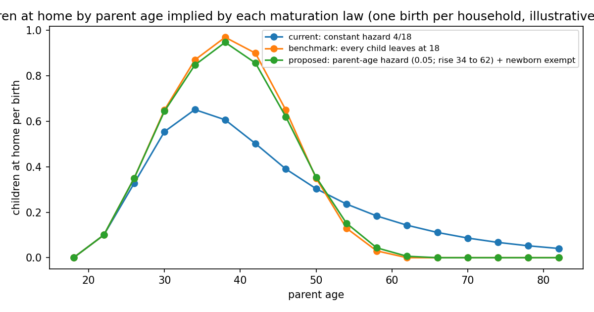

# The object

The model does not track children's ages. It tracks the number of children at
home, \(m\), and applies an exit rule each four-year period. The rule decides
how long a child occupies space, hence the space demand of parents by age,
which is the margin the paper's mechanism runs on. Two facts frame the choice:
the author will not add a child-age state, and the ACS comparison of September
16 showed the current rule leaves 40 percent too few children at home at parent
ages 30–42 while keeping "dependents" past 58 who in the data are adult
children living with parents.

# The two laws

**Current law.** Every child at home leaves with the same probability
\(\mu=4/18\approx0.22\) each period, whatever the parent's age and however
recently the child was born. Time at home is geometric: no minimum, no
maximum. A newborn has a 22 percent chance of being gone by the next date;
8 percent of children are still home after forty years.

**Proposed law.** The exit probability depends on the parent's age \(a\):
\(\mu(a)=\mu_y\) while \(a<a_r\), rising linearly to one at \(a_f\), and one
after. A child born this period is exempt from this period's draw. Three
numbers, chosen once: \(\mu_y=0.05\), \(a_r=34\), \(a_f=62\). Still no child
state.

# What each law implies

The figure applies each law to one birth per household, with an illustrative
distribution of first-birth ages (10 percent at 22, 25 at 26, 30 at 30, 22 at
34, 10 at 38, 3 at 42), and compares with the benchmark in which every child
leaves at exactly 18.

| Law | Years at home per child | Share of child-years while parent is under 46 | Share of child-years at parent age 62+ |
|---|---:|---:|---:|
| Benchmark: leaves at 18 | 20.0 | 0.77 | 0.00 |
| Current: constant hazard | 17.4 | 0.63 | 0.12 |
| Proposed: parent-age hazard, newborn exempt | 19.7 | 0.76 | 0.00 |

The current law is wrong at both ends at once: it removes children too early
(only 63 percent of child-years fall in the parent's under-46 window, against
77) and too late (12 percent of child-years are at parent ages above 62,
against zero). The proposed law matches the benchmark on both counts to within
a point. The three parameters were chosen by a grid search on the root mean
square distance between the profiles (0.016 for the proposed law against 0.17
for the current one); a rise starting later, at 46, does worse than the current
law on the under-46 share, which is why the start is at 34.

# The trade-off, stated honestly

What the proposed law buys: no orphan flow (every child has left before any
parent can die, since mortality starts at 66); no adult "dependents"; a young
parent's expected space need in the birth period no longer cut by a fifth;
the model's children-at-home profile can meet the ACS at both ends.

What it costs: the exit clock is the parent's, not the child's. A child born
to a 22-year-old faces the same low hazard until the parent is 34, then a
rising one, so it leaves around the parent's mid-40s, at 20 to 24 rather than
18; a child born to a 40-year-old leaves between the parent's 50s and 62, that
is, at 12 to 22. The error is largest for the earliest and latest births and
zero for births around 30, which is where most first births are. With the
illustrative birth ages the average error nets out (19.7 years against 20).

What it does not do: it does not distinguish two children of different ages in
the same household; both face the parent's hazard. Under the current law they
are also indistinguishable, so nothing is lost relative to now.

# Interaction with the rest of the model

Changing the law changes the model counterpart of every moment defined on
children at home: the rooms gap between three-plus and one-to-two-child
families, the first-birth rooms response, and the childlessness and
one-child shares insofar as \(m\) feeds the taste-scale switch. The space
floor \(h_P\) and the continuation scale \(\kappa_C\) will move at the refit.
Until then, the test is the profile: children at home by parent age, model
against ACS, which the sandbox diagnostic already produces.

# Recommendation

Adopt the parent-age law with the newborn exemption at \((0.05, 34, 62)\),
implemented as a default-off switch (task spec in
`docs/prompts/TASK_muse_maturation_switch_20260917.md`), and confirm with the
ACS profile before any refit. Revisit only if the profile still misses at
30–42, which would say the remaining gap is fertility, not maturation.
