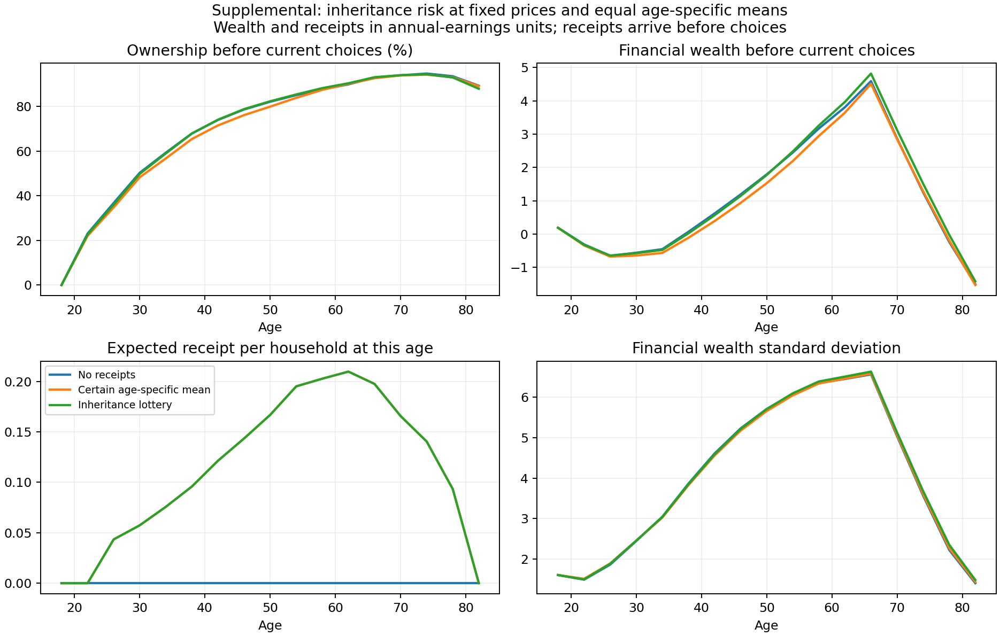

# Inheritance uncertainty: completed fixed-price test

4 household solves; wealth-grid subdivision 2. Experimental, not recalibrated or funded general equilibrium.

The no-receipt control exactly reproduces a fresh unpatched net-valuation solve and calendar distribution on the finer grid. All 13 numerical tests, the ordered-loop smoke and native calendar/budget/purchase/fiscal/value/probability checks pass. No occupied wealth is clipped. The two receipt cases have the same expected transfer at each age and the same fixed house price. Housing and estate funding residuals below are deliberately reported.

All economic changes are experimental: age-pooled published receipt profiles, zero receipts outside supported model nodes26–78, IID receipt risk, and start-period liquid-wealth timing. The certain and lottery cases share this timing. Entry wealth, B15 earnings, preferences, the inherited 8.751% tax and the frozen target/weight contract remain fixed. The target table includes the inherited experimental first-birth rooms target1.465; this does not adopt it as the future empirical/model observation contract.

| Moment | Target | No receipts | Certain mean | Lottery |
|---|---:|---:|---:|---:|
| initial_normalization | 2.100 | 2.126 | 2.217 | 2.166 |
| cps_childlessness | 0.198 | 0.175 | 0.145 | 0.162 |
| cps_exactly_one | 0.214 | 0.228 | 0.221 | 0.225 |
| nchs_mean_age | 25.976 | 26.190 | 26.122 | 26.195 |
| nchs_share30 | 0.249 | 0.239 | 0.235 | 0.239 |
| wealth_earnings | 6.927 | 6.054 | 5.961 | 6.251 |
| bequest_wealth | 0.007 | 0.007 | 0.007 | 0.007 |
| old_dispersion | 3.516 | 3.000 | 2.889 | 2.786 |
| mean_rooms | 5.608 | 6.553 | 6.724 | 6.707 |
| ownership_30_55 | 0.676 | 0.756 | 0.735 | 0.757 |
| first_birth_rooms | 1.465 | 0.794 | 0.733 | 0.764 |
| family_rooms | 0.385 | 0.219 | 0.200 | 0.210 |
| recent_parent_ownership | 0.128 | 0.080 | 0.030 | 0.064 |

| Case | Inherited loss | House-market residual | Paid − generated estates |
|---|---:|---:|---:|
| no_receipt | 302.060 | 0.110% | -1.142e-01 |
| conditional_mean | 624.166 | 2.952% | -1.097e-03 |
| receipt_lottery | 424.947 | 2.691% | -6.446e-03 |

[Full target fits: every gap, weight and loss contribution](full_target_fit.csv)

[Every parameter, estimate, bound, restriction and near-bound flag](parameters.csv)

[Estate accounts and run diagnostics](accounts.csv)

The 17 standard figures for each case are retained unchanged:

- [no_receipt, figures1–9](no_receipt_standard_contact_1.png)
- [no_receipt, figures10–17](no_receipt_standard_contact_2.png)

- [conditional_mean, figures1–9](conditional_mean_standard_contact_1.png)
- [conditional_mean, figures10–17](conditional_mean_standard_contact_2.png)

- [receipt_lottery, figures1–9](receipt_lottery_standard_contact_1.png)
- [receipt_lottery, figures10–17](receipt_lottery_standard_contact_2.png)

[Wealth-grid sensitivity: changes in each receipt effect relative to its own control](grid_effect_comparison.csv)
