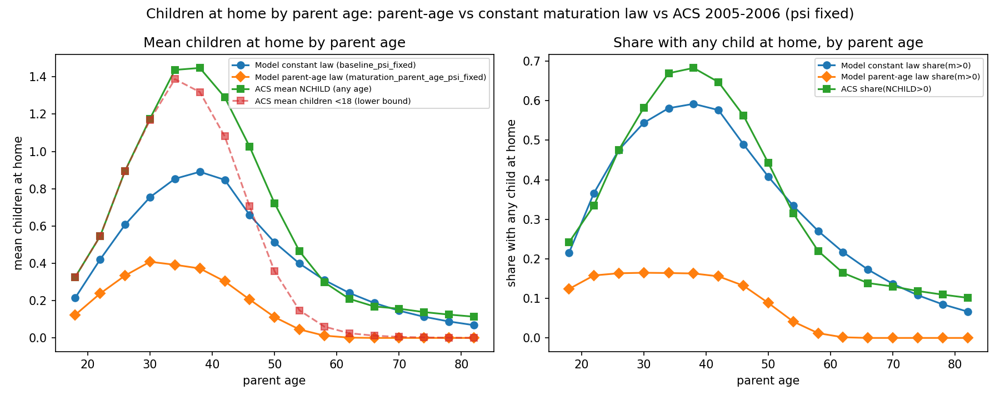

# Maturation switch evaluation: parent-age law vs. constant law (psi fixed)

## What was run

- Spec `maturation_parent_age_psi_fixed`
  (`code/model/sandbox/specs/maturation_parent_age_psi_fixed.yaml`):
  `child_maturation_mode: parent_age`, `mu_young: 0.05`, `a_rise: 34.0`,
  `a_full: 62.0`, `psi_mode: fixed` (psi_child held at the retained 0.14891531).
- Solved at the full production grid (Nb=120, J=17) via
  `code/model/sandbox/run_ss.py --spec maturation_parent_age_psi_fixed`
  (1 GE evaluation, 107.9 s wall time, price root warm-started from
  `output/model/sandbox/baseline/parameters.csv`; status `fixed_intercept`).
  Four-file output (`summary.md`, `moments.csv`, `parameters.csv`, `graphs.pdf`)
  lives in this folder alongside the files below.
- Children-at-home-by-parent-age profiles for **both**
  `maturation_parent_age_psi_fixed` and `baseline_psi_fixed` were solved fresh
  at full grid through the (minimally extended) diagnostic
  `code/model/sandbox/diagnostics_dependents_by_age.py`, which now accepts
  `--spec <name>` (default `baseline_psi_fixed`; solve path and ACS side
  unchanged). Model `m` = children currently at home from `sol.g` under
  `child_state_mode=independent_count`. ACS = 2005-2006 pooled household heads
  (extract27.dta), 4-year bins aligned to model ages. Per-spec runs went to
  scratch (`/tmp`); only the combined artifacts below were kept here.

## Figure and data

- `dependents_by_age.png` — left: mean children at home by parent age (both
  model laws + ACS any-age NCHILD + ACS under-18 lower bound); right: share
  with any child at home (both model laws + ACS).
- `dependents_by_age.csv` — one row per age: `model_baseline_mean_m`,
  `model_maturation_mean_m`, `acs_mean_m_any_age`, `acs_mean_m_under18_lb`,
  plus the three `share_pos` columns.
- `spec_comparison.csv` — machine-readable version of the table below.

## Spec comparison (both at psi fixed, full grid)

| Moment | baseline_psi_fixed (constant law) | maturation_parent_age_psi_fixed (parent-age law) | Maturation − baseline |
|---|---:|---:|---:|
| Completed fertility | 1.8717 | 0.4897 | −1.3820 |
| Childless share | 0.2386 | 0.8345 | +0.5959 |
| Mean first-birth age | 26.9613 | 21.1916 | −5.7697 |
| First births at 30+ | 0.2847 | 0.0150 | −0.2697 |
| Ownership 30–55 | 0.4585 | 0.5097 | +0.0512 |
| Mean rooms | 5.7180 | 5.4137 | −0.3043 |
| First-birth rooms response | 1.0719 | 0.2573 | −0.8146 |
| Three-plus vs one-to-two rooms gap | 0.3080 | −0.1856 | −0.4936 |
| Price (solved `_solved_price`) | 0.7906 | 0.7663 | −0.0243 |
| Orphan flow (dependents lost at parental death per period) | not exposed by diagnostics | not exposed by diagnostics | n/a |

Notes: moment rows are the stationary `extract_moments` analogues from each
run's `moments.csv` (fertility-timing and rooms rows are approximate analogues
per `sandbox/target_table.py`; the exactly-one-child row has no analogue and is
omitted). No `extract_moments` key or diagnostic exposes dependents lost at
parental death per period (checked by searching the package for
orphan/parental-death/dependent-loss moments), so the orphan flow is reported
as not exposed rather than fabricated. Price is the scalar `_solved_price`
from each run's `parameters.csv`.

## Five-line reading (mean absolute error of model mean E[m] vs ACS, by band)

1. Ages 26–34 vs ACS any-age mean: constant law MAE 0.431, parent-age law MAE
   0.791 — the parent-age law is **farther** by 0.360.
2. Ages 38–46 vs ACS any-age mean: constant 0.455, parent-age 0.961 — the
   parent-age law is **farther** by 0.505.
3. Ages 58+ vs ACS any-age mean: constant 0.026, parent-age 0.171 — the
   parent-age law is **farther** by 0.145 (both near zero; the parent-age law
   undershoots to exactly 0.0 from age 66).
4. Ages 58+ vs the ACS under-18 lower bound is the one exception: constant
   0.150, parent-age 0.014 — the parent-age law is **closer** by 0.136, because
   its age-rising exit hazard kills the memoryless geometric tail of children
   still coded at home that the constant law keeps (0.07–0.31 at ages 58–82).
5. Level confound: with psi fixed, the parent-age law collapses fertility
   (completed fertility 0.49 vs 1.87; childless 0.83 vs 0.24), so bands 1–2
   mostly measure that level miss, not the exit-timing shape; judge the shape
   only after re-normalizing psi to completed fertility 2.1.
