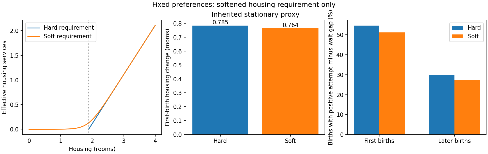

# Soft housing requirement: bounded specification test

September 26, 2026. **Completed experiment; recommendation for the next
calibration, not an adopted production specification.** The first-birth housing
response is preserved at this tested point when literal housing infeasibility
is removed. This is sufficient to recommend the soft requirement for the next
calibration, but does not establish better calibrated fit or resolve the role
of fertility taste shocks.



| Object | Hard requirement | Soft requirement |
|---|---:|---:|
| First-birth housing response, inherited stationary proxy (rooms) | 0.78475 | 0.76351 |
| Fertility measure used for normalization | 2.10000 | 2.19184 |
| Childlessness | 18.279% | 15.485% |
| Zero first-birth attempt probability, at-risk household share | 4.8724% | 0.000455% |
| Same share among households with nonpositive liquid wealth | 7.4455% | 0.000719% |
| First births from positive attempt-minus-wait gaps | 54.654% | 51.139% |
| Later births from positive attempt-minus-wait gaps | 29.763% | 27.297% |
| Parent renters living below the old housing floor | 0% | 0.01151% |
| Asset price | 0.612807 | 0.613815 |
| Inherited descriptive loss at fixed preferences | 285.640 | 436.915 |

The softened model retains about 97.3% of the control housing response. Its
housing requirement remains behaviorally strong: very few parent renters
choose housing below the former floor. Zero choice probabilities combine
infeasibility and numerical underflow; the table does not identify those
causes separately. Nonpositive liquid wealth is an asset category, not an
income-poverty classification. Changes in population-weighted incentive shares
also reflect changed composition and prices, not just within-state preferences.

The first-birth proxy remains below the inherited 1.465-room target in both
cases. It is not a matched empirical event-study estimator. The original ACS
quantity target and all weights are retained only to keep this comparison
controlled; the adopted AHS target is not substituted mid-experiment. Loss
worsens without recalibration. No optimized comparison or specification winner
on fit is claimed.

## Economic change and maintained objects

For parents, effective housing services become

\[
g_\delta(h)=\delta\left[\log(1+e^{(h-h_P)/\delta})
-\log(1+e^{-h_P/\delta})\right],\qquad \delta=0.1h_P.
\]

The tested floor parameter is \(h_P=1.89004766\) rooms. The width is an
**experimental external restriction**, not an estimated parameter. Childless
housing services remain \(g(h)=h\). Parent material utility is
\(-e(m)/(c^\alpha g_\delta(h)^{1-\alpha})\), with unchanged linear benefit
\(\psi m\); owner services retain the same owner premium. The first child at
home activates the housing requirement; subsequent children add no further
direct housing requirement. The zero anchor ensures no housing services at
zero housing, while any strictly positive housing choice is feasible in utility.

This is the only economic change. Earnings, entry wealth and income, mortality,
bequests, credit, timing, child benefits, shocks, fiscal rule, housing products,
supply, targets and weights are held fixed. Renter budgets and saving bounds
are altered consistently with removing the positive minimum housing requirement;
owner utility uses the same transformed housing services. Childless conditional
kernels call through to the installed native implementation.

The child-benefit coefficient remains \(0.1339982278467087\). Housing and
pensions clear under the inherited normalized entry/age distribution. The soft
case's demographic replacement gap is **4.190%**; it is reported rather than
closed by refitting the benefit. This is not a closed-population production
equilibrium. No transfer floor, assistance or estate redistribution was added.

## Complete tables and diagnostics

- Full 13-row target fit, including targets, models, gaps, weights and loss
  contributions: [control](control/target_fit.csv), [soft](soft/target_fit.csv).
- All 29 parameters/restrictions, including inherited bounds and near-bound
  indicators: [control](control/parameters.csv), [soft](soft/parameters.csv).
- Fertility incentives: [control](control/incentives.csv),
  [soft](soft/incentives.csv); age tables are in the same folders.
- The unchanged 17-figure diagnostic set is saved under each case's
  `standard_diagnostics/`. The graph above is supplemental.
- [Complete receipt](complete.json), [48 numerical checks](tests.json),
  [exact control replay](control_replay.json),
  [final verification](final_verification.json).

The incentive gap is trying now minus waiting, excluding the current taste
draw but retaining future shock-inclusive continuation values. A negative gap
is not evidence that children are always a lifetime net cost. Softening does
not eliminate the large share of later births occurring at negative gaps.

## Verification and reproduction

Torch job **18603346** completed in 188.6 seconds after authenticated setup.
The preceding job 18603272 passed the 48 tests and reproduced the control
exactly, then stopped before a softened solve because the report omitted the
reconstruction dictionary containing one gate. That reporting wiring was fixed;
no economic assumption or numerical threshold was relaxed.

The control's value, consumption, housing, saving, first-birth probabilities,
later-birth probabilities and population arrays reproduce bit-for-bit. Every
target-table numeric cell reproduces exactly. Soft allocation tests agree with
independent bounded optimization to maximum relative error 8.66e-14. Both cases
pass budget, fiscal, population, purchase and value/probability gates; both have
zero budget-excess mass and zero feasibility-projection mass. The soft housing
market residual is 5.82e-8. The unchanged native dead-value cutoff remains.

Sources: `code/model/tools/run_e5f_soft_housing_probe.py` and
`code/model/tools/e5f_soft_housing_adapter.py`. A small final reporting-only
revision adds the exact target-table assertion, refreshes the endogenous
pension row explicitly, and writes completion after the supplemental figure.
The equivalent checks passed on the saved run; no numerical solve was repeated.
Executed and final source hashes are in `final_verification.json`.

Remote retained run and checkpoint:
`/scratch/td2248/projects/Fertility_Spring26_native_financing_20260919a/soft_housing_probe_20260926/run_002`.
The authenticated control is the selected `floor_linear` point under
`utility_four_arm_preparation_20260925_v2/results/run_001`, checkpoint SHA256
`c2863ae2fe153a92043df45657d5dc7982bb69753afda0557efa85d1c8871f18`.
The full source/target contract fingerprint is in `preflight.json`.

To regenerate the complete diagnostic packet, use a fresh output path in a
Torch allocation (one CPU, 12 GB memory, 25-minute limit):

```bash
module load anaconda3/2025.06
export OMP_NUM_THREADS=1 OPENBLAS_NUM_THREADS=1 MKL_NUM_THREADS=1 NUMBA_NUM_THREADS=1
export PYTHONDONTWRITEBYTECODE=1 MPLBACKEND=Agg PYTHONUNBUFFERED=1
export PYTHONPATH=/scratch/td2248/projects/Fertility_Spring26_native_financing_20260919a/utility_four_arm_preparation_20260925_v2/tools:/scratch/td2248/commute_pdf_qa_deps
python /scratch/td2248/projects/Fertility_Spring26_native_financing_20260919a/soft_housing_probe_20260926/tools/run_e5f_soft_housing_probe.py --stage run --output /scratch/td2248/projects/Fertility_Spring26_native_financing_20260919a/soft_housing_probe_20260926/reproduction
```
