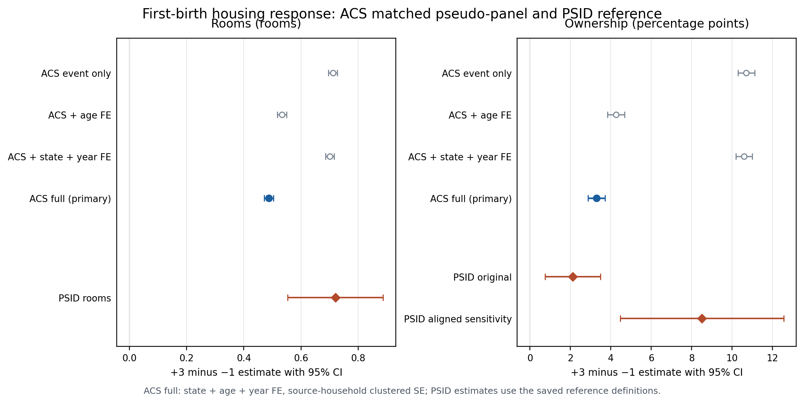

# National ACS first-birth housing comparison

This package compares the completed national ACS matched pseudo-panel estimates
with the saved PSID reference estimates. The comparison is descriptive. The ACS
rows are repeated cross-sectional matched rows, so the estimator N and its
source-household cluster count do not count unique people. The results should
not be read as causal validation, and they do not identify a twins or
second-birth design.

## Primary comparison

The reported contrast is the event-time +3 coefficient minus the event-time
-1 coefficient, with the full covariance matrix used for the standard error.
ACS standard errors are clustered by source household. Ownership is shown in
percentage points in this table; rooms are in rooms.

| Outcome and design | Estimate | 95% CI | Estimator N | Source/person clusters | Weights and fixed effects |
|---|---:|---:|---:|---:|---|
| ACS rooms, full | 0.4877752162 | [0.4720065124, 0.5035439199] | 14,155,689 | 2,765,428 source households | Author matched weight wgt; state + age + year FE |
| PSID rooms, saved reference | 0.7202462624 | [0.5531365618, 0.8873559630] | 49,457 | 4,112 person IDs | IW pweight; person + survey-year FE |
| ACS ownership, full | 3.2914338710 pp | [2.8697870362, 3.7130807059] pp | 14,155,711 | 2,765,435 source households | Author matched weight wgt; state + age + year FE |
| PSID ownership, original arm | 2.1222167479 pp | [0.7516320202, 3.4928014755] pp | 252,343 | 23,761 IDs | Unweighted; survey-year FE |
| PSID ownership, aligned sensitivity | 8.5139268026 pp | [4.4733560153, 12.5544975899] pp | 52,945 | 4,202 person IDs | IW pweight; person + survey-year FE; F6 included |

The PSID ownership rows are intentionally separate. The original arm has no
person fixed effects and is unweighted; the aligned sensitivity adds person
fixed effects, PSID individual survey weights (IW), and F6. Neither is
interchangeable with the ACS design, which uses state, age, and year fixed
effects on matched repeated cross-sections.

The figure also displays the ACS reduced specifications. They are diagnostics,
not alternative primary estimates: rooms are 0.7118366071 (event only),
0.5338044626 (age only), and 0.7006224518 (state + year); ownership is 10.7077954952,
4.2601189655, and 10.5935574575 percentage points, respectively. The full
specification is therefore visibly sensitive to the added fixed effects, and
the report retains all four specifications rather than selecting the closest
cross-dataset number.

## Event-time support and baseline cells

The ACS estimator uses the Weekly matching clock t_es_lw, event window
-5 through +10, and omits event time -2. The event curves and their full
covariance-based confidence intervals are in
[national_event_curves.csv](national_continuation_20260921b/national_event_curves.csv)
and the estimator plot is
[national_housing_event_curves.png](national_continuation_20260921b/national_housing_event_curves.png).
The source years are 2005--2019. Annual rows are excluded from the estimator
pool; the event clock is checked against t_es_lw before fitting.

The following cells are the requested pre/post support summary. N is the
number of constructed rows in that event cell; source HH is the number of
source-household clusters. ESS is the event-specific Kish effective sample
size computed on the base/outcome-valid constructed rows. It is neither an
independent-household ESS nor the total-fit ESS, and ESS values must not be
added across event times.

| Outcome | Event | N | Source HH | Weighted baseline | Event-specific Kish ESS |
|---|---:|---:|---:|---:|---:|
| Ownership | -1 | 2,937,248 | 690,331 | 0.5778046338 | 353,462.1139 |
| Ownership | +3 | 124,510 | 124,086 | 0.6848825887 | 79,969.2690 |
| Rooms (cap at 9) | -1 | 2,937,243 | 690,329 | 5.4136874549 | 353,457.7077 |
| Rooms (cap at 9) | +3 | 124,510 | 124,086 | 6.1255240619 | 79,969.2690 |

The event-cell baseline means are raw weighted means before the fixed-effect
regression. The fit N above is different because it is the complete
regression sample, not the sum of the event-cell rows.

## Measurement and timing

The ACS housing fields are measured on the matched household row. ROOMS keeps
valid codes 1--27 and 30 and caps them at 9 (0 and 28 are non-room or unknown
codes); ownership maps OWNERSHP==1 to owner and OWNERSHP==2 to renter. No CPS
housing imputation is used. The event is the first-birth matched event clock,
not a person-level panel transition. The ACS sample follows the author
first-birth matching design for women ages 25--45. The saved PSID rooms
reference uses the first biological birth, shifts ACTUALROOMS forward one
observed interview, omits -2, and reports L3 minus F1. The corrected PSID arms
use the women-18-and-over reference-spouse, household-deduplicated sample;
the original PSID ownership arm preserves its own clock and sample definition.
No rooms recoding or harmonization beyond the saved PSID reference is imposed.

## Reproducibility and identity receipts

The continuation completed all 12 requested fits: rooms, ownership, and the
diagnostic bedrooms outcome under full, event-only, age-only, and state + year
specifications. Each fit has coefficient, full covariance, contrast, and JSON
receipt files in
[national_continuation_20260921b/](national_continuation_20260921b/).

The input identity was unchanged from start to end: the pooled panel is
6,354,971,545 bytes with mtime 2026-09-21T23:12:14.904017Z. The original
production, pool, snapshot, and 51 state receipts were identity-checked at both
ends. The original checkpoint files were preserved; the one explicitly
diagnosed as unreadable was bypassed only under the recorded repair path. No
panel rematch or raw-data reload occurred during continuation.

The saved PSID source is
[psid_reference_for_acs.csv](../psid_fullsample_staging_20260921/psid_reference_for_acs.csv).
The compact ACS tables are national_contrasts.csv,
national_raw_baselines.csv, national_counts_event_ess.csv, and
national_fit_status.csv in the continuation directory.
